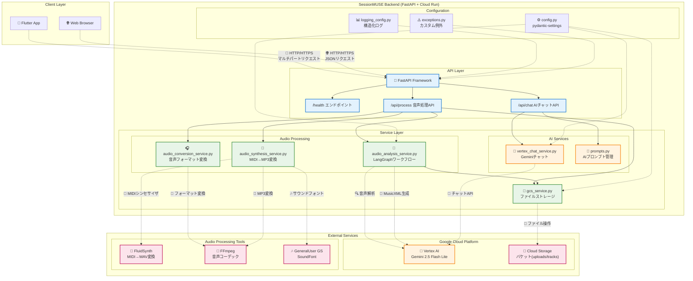
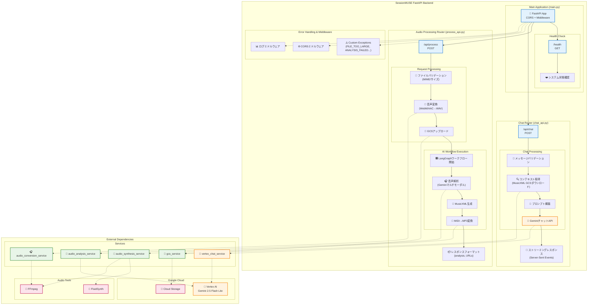
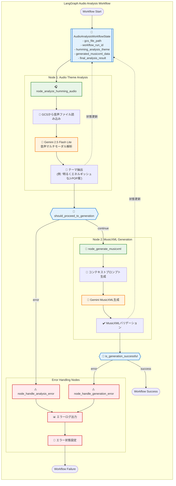
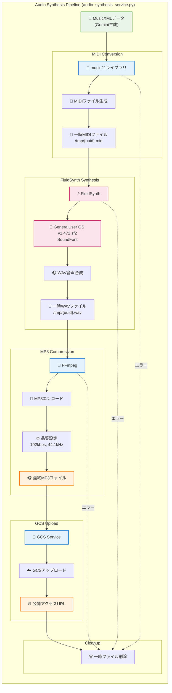

# SessionMUSE バックエンドAPI詳細設計書 (実装版)

## 1. はじめに
本設計書は、SessionMUSE バックエンドAPIの現在の実装状況を正確に反映した技術仕様書です。実際のコードベースに基づいた詳細なアーキテクチャ設計と実装パターンを記述しています。

## 2. アーキテクチャ概要と設計方針

### 2.0. システムアーキテクチャ概要

SessionMUSE バックエンドの全体アーキテクチャとコンポーネント間の関係を示します。



### 2.1. 核心的設計思想
SessionMUSE は「音楽的テーマ理解」を中心とした AI 音楽パートナーとして設計されています。従来の音楽パラメータ（キー、BPM、コード進行）の構造化抽出から、より人間的で直感的な「トラックの雰囲気/テーマ」理解へとアプローチを進化させています。

### 2.2. 技術アーキテクチャの特徴
 * **フレームワーク**: FastAPI - Python型ヒント、自動バリデーション、OpenAPI準拠のドキュメント生成
 * **実行環境**: Google Cloud Run - コンテナベースのサーバーレス実行、自動スケーリング対応
 * **AIエンジン**: Google Gemini 2.5 Flash Lite Preview - マルチモーダル音声解析とMusicXML生成
 * **ワークフロー管理**: LangGraph - AI処理の状態管理と非同期実行制御
 * **音楽合成パイプライン**: MusicXML → MIDI → WAV → MP3 変換チェーン
 * **ストレージ**: Google Cloud Storage - 音声ファイル、MusicXML、生成MP3の管理
 * **音声処理**: 複数フォーマット対応（MP3/WAV/M4A/AAC/WebM）+ 自動変換機能

### 2.3. イベント駆動型アーキテクチャの準備
現在の実装は、将来的なEventarcとの統合を見据えた設計となっており、ファイルアップロードをトリガーとする非同期処理への移行が容易な構造を採用しています。

### 2.4. 設定管理（現在の実装）
アプリケーション設定は `pydantic-settings` を使用したタイプセーフな管理を実装しています。

#### 主要設定項目（config.py）:
```python
class Settings(BaseSettings):
    # GCS ストレージ設定
    GCS_UPLOAD_BUCKET: str       # ユーザーアップロードファイル用バケット
    GCS_TRACK_BUCKET: str        # 生成されたMusicXML/MP3用バケット
    GCS_LIFECYCLE_DAYS: int = 1   # 自動削除までの日数
    
    # Vertex AI / Gemini 設定
    VERTEX_AI_LOCATION: str = "global"
    ANALYZER_GEMINI_MODEL_NAME: str = "gemini-2.5-flash-lite-preview-06-17"
    GENERATOR_GEMINI_MODEL_NAME: str = "gemini-2.5-flash-lite-preview-06-17"
    CHAT_GEMINI_MODEL_NAME: str = "gemini-2.5-flash-lite-preview-06-17"
    VERTEX_AI_TIMEOUT_SECONDS: int = 120
    
    # アプリケーション設定
    LOG_LEVEL: str = "INFO"
    MAX_FILE_SIZE_MB: int = 100
    PORT_LOCAL_DEV: int = 8000
```

#### 設定の特徴:
- **統一Geminiモデル**: すべてのAI処理で `gemini-2.5-flash-lite-preview-06-17` を使用
- **分離されたストレージ**: アップロードとトラック用で異なるGCSバケット
- **環境別設定**: `.env` ファイルまたは環境変数による設定注入対応


## 3. 技術スタック（実装詳細）

### 3.1. 核心フレームワークとライブラリ
| カテゴリ | 技術/ライブラリ | 実装での役割 |
|---|---|---|
| **Webフレームワーク** | FastAPI | APIエンドポイント、自動バリデーション、OpenAPIドキュメント生成 |
| **ASGIサーバー** | Uvicorn | 本番・開発環境でのFastAPIアプリケーション実行 |
| **データモデル** | Pydantic v2 | リクエスト/レスポンスモデル、設定管理 (`pydantic-settings`) |
| **AI処理基盤** | LangChain + LangGraph | Gemini APIとの統合、ワークフロー状態管理 |
| **Vertex AI統合** | langchain-google-vertexai | Google Gemini 2.5モデルとの直接連携 |
| **音楽処理** | music21, pydub | MusicXML→MIDI変換、MP3音声処理 |
| **音声合成** | FluidSynth | MIDI→WAV変換（`GeneralUser GS v1.472.sf2` SoundFont使用）|
| **クラウドストレージ** | google-cloud-storage | GCS操作（アップロード/ダウンロード/公開URL生成）|
| **音声変換** | カスタム実装 | WebM/AAC→WAV変換サービス |

### 3.2. アーキテクチャ構成
```
┌─────────────────┐    ┌──────────────────┐    ┌─────────────────┐
│   FastAPI App   │────│   LangGraph      │────│  Gemini 2.5     │
│   (main.py)     │    │   Workflow       │    │  Flash Lite     │
└─────────────────┘    └──────────────────┘    └─────────────────┘
         │                       │                       │
         │                       │                       │
┌─────────────────┐    ┌──────────────────┐    ┌─────────────────┐
│   GCS Service   │    │ Audio Analysis   │    │ Audio Synthesis │
│   (Storage)     │    │ Service          │    │ Service         │
└─────────────────┘    └──────────────────┘    └─────────────────┘
         │                       │                       │
         │                       │                       │
┌─────────────────┐    ┌──────────────────┐    ┌─────────────────┐
│  Cloud Storage  │    │   MusicXML       │    │   FluidSynth    │
│  (Audio Files)  │    │   Generator      │    │   (MIDI→WAV)    │
└─────────────────┘    └──────────────────┘    └─────────────────┘
```


## 4. APIエンドポイント詳細（現在の実装）

### 4.0. APIエンドポイント全体構成

FastAPIフレームワークによるRESTful API設計と各エンドポイントの関係を示します。



### 4.1. 音声処理API（テーマベース + MusicXML生成）
**エンドポイント**: `POST /api/process`

**説明**: ユーザーの口ずさみ音声から「トラックの雰囲気/テーマ」を理解し、MusicXMLとMP3を生成する新世代の音楽AI処理。

#### リクエスト仕様:
```http
POST /api/process
Content-Type: multipart/form-data

file: <音声ファイル>
```

#### 対応音声フォーマット:
- **MP3** (`audio/mpeg`)
- **WAV** (`audio/wav`, `audio/x-wav`)  
- **M4A** (`audio/mp4`, `audio/x-m4a`)
- **AAC** (`audio/aac`)
- **WebM** (`audio/webm`) ※自動WAV変換

#### 処理フローの革新（従来のパラメータ抽出 → テーマ理解）:

1. **マルチフォーマット音声受信**
   - 自動MIME検出とファイル拡張子マッピング
   - WebM/AAC → WAV 自動変換（AudioConversionService）
   - ファイルサイズ検証（MAX_FILE_SIZE_MB）

2. **GCSストレージ管理**
   ```python
   # アップロード先: gs://{GCS_UPLOAD_BUCKET}/original/{file_id}.{ext}
   gcs_original_file_uri = await gcs_service.upload_file_obj_to_gcs(
       file_obj=processed_file_obj,
       bucket_name=settings.GCS_UPLOAD_BUCKET,
       destination_blob_name=f"original/{file_id}{extension}"
   )
   ```

3. **LangGraphによるAIワークフロー実行**

   ワークフローエンジンは状態管理、エラーハンドリング、非同期処理を統合管理します。



   ```python
   # AudioAnalysisWorkflowState の管理
   workflow_state = await run_audio_analysis_workflow(gcs_file_path)
   
   # ワークフローノード:
   # 1. node_analyze_humming_audio: 口ずさみ → テーマ解析
   # 2. node_generate_musicxml: テーマ → MusicXML生成
   ```

4. **AI解析: 口ずさみ → トラックテーマ**
   ```python
   # Gemini 2.5 Flash Lite による直接音声理解
   humming_theme = await audio_analyzer.analyze_humming_audio(
       gcs_file_path, workflow_run_id
   )
   # 例: "明るくエネルギッシュなJ-POP風のメロディー"
   ```

5. **MusicXML生成**
   ```python
   # テーマと音声から構造化された楽譜データを生成
   musicxml_data = await audio_analyzer.generate_musicxml_from_theme(
       gcs_file_path, humming_theme, workflow_run_id
   )
   ```

6. **音楽合成パイプライン**

   AIが生成したMusicXMLから高品質MP3ファイルを生成するパイプラインを示します。



   ```python
   # MusicXML → MIDI → WAV → MP3
   mp3_data = await audio_synthesis_service.synthesize_musicxml_to_mp3(
       musicxml_data
   )
   # FluidSynth + GeneralUser GS v1.472.sf2 SoundFont使用
   ```

7. **マルチファイル配信**
   ```json
   {
     "analysis": {
       "humming_theme": "明るくエネルギッシュなJ-POP風のメロディー"
     },
     "backing_track_url": "https://storage.googleapis.com/.../file.musicxml",
     "original_file_url": "https://storage.googleapis.com/.../original.wav", 
     "generated_mp3_url": "https://storage.googleapis.com/.../generated.mp3"
   }
   ```

#### エラーハンドリング:
- **413**: ファイルサイズ超過 (`FILE_TOO_LARGE`)
- **415**: 非対応フォーマット (`UNSUPPORTED_MEDIA_TYPE`) 
- **503**: AI解析失敗 (`ANALYSIS_FAILED`)
- **503**: MusicXML生成失敗 (`GENERATION_FAILED`)
- **503**: 音声変換失敗 (`AUDIO_CONVERSION_EXCEPTION`)


### 4.2. AIチャットAPI（MusicXML対応の音楽相談）
**エンドポイント**: `POST /api/chat`

**説明**: 音楽的テーマとMusicXMLを理解するAI音楽パートナーとの対話。抽象的な表現も具体的なアドバイスに変換。

#### リクエスト仕様:
```json
{
  "messages": [
    {"role": "user", "content": "このメロディーをもっとドラマチックにするには？"},
    {"role": "assistant", "content": "マイナーセブンスコードを..."}
  ],
  "analysis_context": {
    "humming_theme": "明るくエネルギッシュなJ-POP風のメロディー"
  },
  "musicxml_gcs_url": "https://storage.googleapis.com/.../file.musicxml"
}
```

#### 処理フローの特徴:

1. **高度なコンテキスト理解**
   ```python
   # vertex_chat_service.py 実装
   context_parts = []
   if analysis_context and analysis_context.humming_theme:
       context_parts.append(f"ユーザーが口ずさんだメロディの雰囲気/テーマ: 「{analysis_context.humming_theme}」")
   
   if musicxml_content:
       context_parts.append(f"このテーマに基づいて生成されたMusicXMLの内容:\n```musicxml\n{musicxml_content}\n```")
   ```

2. **MusicXMLダウンロードと統合**
   ```python
   # GCS URLからMusicXMLコンテンツを取得
   if musicxml_gcs_url:
       musicxml_content = await gcs_service.download_file_as_string_from_gcs(
           musicxml_gcs_url
       )
   ```

3. **SessionMUSE AIペルソナ**
   - プロンプトベースの音楽理論専門家
   - 抽象的表現 → 具体的技術アドバイス変換
   - ポジティブ&建設的フィードバック

4. **ストリーミング対応**
   ```python
   # SSE (Server-Sent Events) でリアルタイム応答
   Accept: text/event-stream
   
   # レスポンス形式
   data: {"role": "assistant", "content": "その場合は"}
   data: {"role": "assistant", "content": "Dマイナーに"}
   data: {"role": "assistant", "content": "転調することで..."}
   ```

#### エラーハンドリング:
- **400**: リクエスト形式不正 (`INVALID_REQUEST`)
- **503**: Vertex AI API エラー (`VERTEX_AI_API_ERROR`)
- **503**: セーフティフィルターブロック (`VERTEX_AI_API_ERROR`)
- **503**: タイムアウト (`VERTEX_AI_API_ERROR`)


## 5. データモデル（現在の実装版）

SessionMUSE の現在のデータモデルは、テーマベースの音楽理解とMusicXML生成ワークフローに特化した設計となっています。

### 5.0. データモデル関係図

Pydanticモデルとデータフローの関係を示します。

```mermaid
classDiagram
    class ErrorCode {
        <<enumeration>>
        +INVALID_REQUEST
        +FILE_TOO_LARGE
        +UNSUPPORTED_MEDIA_TYPE
        +ANALYSIS_FAILED
        +GENERATION_FAILED
        +VERTEX_AI_API_ERROR
        +AUDIO_CONVERSION_EXCEPTION
    }
    
    class SessionMUSEHTTPException {
        +error_code: ErrorCode
        +message: str
        +details: Dict[str, Any]
        +status_code: int
        +headers: Dict[str, str]
    }
    
    class AudioAnalysisWorkflowState {
        +gcs_file_path: str
        +workflow_run_id: Optional[str]
        +humming_analysis_theme: Optional[str]
        +generated_musicxml_data: Optional[str]
        +final_analysis_result: Optional[AnalysisResult]
    }
    
    class AnalysisResult {
        +humming_theme: str
        +supporting_analysis: Optional[str]
    }
    
    class ProcessResponseData {
        +analysis: AnalysisResult
        +original_file_url: str
        +backing_track_url: str
        +generated_mp3_url: str
    }
    
    class ChatRequest {
        +messages: List[ChatMessage]
        +musicxml_gcs_url: Optional[str]
        +analysis_context: Optional[AnalysisResult]
    }
    
    class ChatMessage {
        +role: str
        +content: str
    }
    
    class ChatResponse {
        +role: str
        +content: str
    }
    
    class HealthCheckResponse {
        +status: str
        +timestamp: str
        +version: str
        +environment: str
    }
    
    %% Relationships
    SessionMUSEHTTPException --> ErrorCode : uses
    AudioAnalysisWorkflowState --> AnalysisResult : contains
    ProcessResponseData --> AnalysisResult : contains
    ChatRequest --> ChatMessage : contains
    ChatRequest --> AnalysisResult : references
    
    %% Data Flow Relationships
    AudioAnalysisWorkflowState -.-> ProcessResponseData : generates
    ChatRequest -.-> ChatResponse : produces
    
    classDef errorClass fill:#ffebee,stroke:#d32f2f,stroke-width:2px
    classDef workflowClass fill:#e8f5e8,stroke:#388e3c,stroke-width:2px
    classDef apiClass fill:#e3f2fd,stroke:#1976d2,stroke-width:2px
    classDef dataClass fill:#fff3e0,stroke:#f57c00,stroke-width:2px
    
    class ErrorCode,SessionMUSEHTTPException errorClass
    class AudioAnalysisWorkflowState workflowClass
    class ProcessResponseData,ChatRequest,ChatResponse,HealthCheckResponse apiClass
    class AnalysisResult,ChatMessage dataClass
```

### 5.1. エラー管理モデル
```python
class ErrorCode(str, Enum):
    INVALID_REQUEST = "INVALID_REQUEST"
    INVALID_FILE_TYPE = "INVALID_FILE_TYPE"
    FILE_TOO_LARGE = "FILE_TOO_LARGE"
    UNSUPPORTED_MEDIA_TYPE = "UNSUPPORTED_MEDIA_TYPE"
    GCS_UPLOAD_ERROR = "GCS_UPLOAD_ERROR"
    ANALYSIS_FAILED = "ANALYSIS_FAILED"
    GENERATION_FAILED = "GENERATION_FAILED"
    VERTEX_AI_API_ERROR = "VERTEX_AI_API_ERROR"          # Gemini API専用
    EXTERNAL_SERVICE_ERROR = "EXTERNAL_SERVICE_ERROR"
    INTERNAL_SERVER_ERROR = "INTERNAL_SERVER_ERROR"
    AUTHENTICATION_REQUIRED = "AUTHENTICATION_REQUIRED"
    FORBIDDEN_ACCESS = "FORBIDDEN_ACCESS"
    RATE_LIMIT_EXCEEDED = "RATE_LIMIT_EXCEEDED"

class ErrorDetail(BaseModel):
    code: ErrorCode
    message: str
    detail: Optional[str] = None

class ErrorResponse(BaseModel):
    error: ErrorDetail
```

### 5.2. 音声処理APIモデル（革新的変更）

#### 従来モデル（削除済み）:
```python
# ❌ 削除されたモデル（過去の構造化アプローチ）
# class ChordProgressionOutput, KeyOutput, BpmOutput, GenreOutput
```

#### 現在のモデル（テーマベース）:
```python
# ✅ 新しいアプローチ: 人間的な音楽理解
class AnalysisResult(BaseModel):
    humming_theme: str = Field(
        ..., 
        description="口ずさみ音声から解析されたトラックの雰囲気/テーマ", 
        example="明るくエネルギッシュなJ-POP"
    )
    # 注意: key, bpm, chords, genre_by_ai は廃止

class ProcessResponse(BaseModel):
    analysis: AnalysisResult
    backing_track_url: HttpUrl = Field(
        ..., 
        description="生成されたバッキングトラックMusicXMLの公開URL"
    )
    original_file_url: Optional[HttpUrl] = Field(
        None, 
        description="アップロードされたオリジナル音声ファイルの公開URL"
    )
    generated_mp3_url: Optional[HttpUrl] = Field(
        None, 
        description="生成されたMP3ファイルの公開URL"
    )
```

### 5.3. チャットAPIモデル（MusicXML対応）
```python
class ChatMessage(BaseModel):
    role: Literal["user", "assistant"]
    content: str

class ChatRequest(BaseModel):
    messages: List[ChatMessage] = Field(
        ..., 
        min_length=1, 
        description="対話履歴。最低1件のメッセージが必要。"
    )
    analysis_context: Optional[AnalysisResult] = Field(
        None, 
        description="現在の楽曲の解析情報（トラックの雰囲気/テーマ）"
    )
    musicxml_gcs_url: Optional[HttpUrl] = Field(
        None, 
        description="MusicXMLファイルが格納されているGoogle Cloud StorageのURL。指定された場合、ここからMusicXMLを取得します。"
    )
```

### 5.4. 内部ワークフロー状態管理（LangGraph）
```python
class AudioAnalysisWorkflowState(TypedDict):
    gcs_file_path: str
    workflow_run_id: Optional[str]
    humming_analysis_theme: Optional[str]
    humming_analysis_error: Optional[str] 
    generated_musicxml_data: Optional[str]
    musicxml_generation_error: Optional[str]
    final_analysis_result: Optional[AnalysisResult]
    analysis_handled: Optional[bool]
    generation_handled: Optional[bool]
    entry_point_completed: Optional[bool]
```

### 5.5. モデル設計の哲学的変化

| 従来のアプローチ | 現在のアプローチ |
|---|---|
| 構造化パラメータ抽出 | テーマベース理解 |
| キー・BPM・コード | 雰囲気・感情・スタイル |
| 機械的データ | 人間的表現 |
| MIDI直接生成 | MusicXML → MP3パイプライン |


## 6. セキュリティと堅牢性（実装詳細）

### 6.1. 多層防御アーキテクチャ

SessionMUSEは本番運用を見据えた包括的なセキュリティ・堅牢性機能を実装しています。

#### 主要ミドルウェア（main.py実装）:
```python
# 1. CORS設定 - フロントエンドアクセス制御
app.add_middleware(
    CORSMiddleware,
    allow_origins=["*"],  # 開発用: 本番では具体的ドメイン指定
    allow_credentials=True,
    allow_methods=["*"],
    allow_headers=["*"],
)

# 2. 相関ID管理 - リクエスト追跡
app.add_middleware(
    CorrelationIdMiddleware,
    header_name='X-Request-ID',
    generator=lambda: uuid4().hex,
)

# 3. 包括的ログミドルウェア - 全リクエスト記録
@app.middleware("http")
async def log_requests_middleware(request: Request, call_next):
    # 詳細なリクエスト/レスポンス情報をログに記録
```

### 6.2. 階層化例外ハンドリング

#### カスタム例外クラス:
```python
# exceptions.py より
class AppException(Exception):
    """基底カスタム例外"""
    def __init__(self, message: str, error_code: ErrorCode, status_code: int, detail: Optional[str] = None)

class AnalysisFailedException(AppException):
    """AI音声解析失敗"""
    
class GenerationFailedException(AppException):
    """MusicXML生成失敗"""
    
class VertexAIAPIErrorException(AppException):
    """Gemini API専用エラー"""
    
class AudioConversionException(AppException):
    """音声変換失敗"""
```

#### 包括的例外ハンドラ（main.py）:
```python
@app.exception_handler(RequestValidationError)
async def request_validation_exception_handler(request, exc):
    # Pydanticバリデーションエラー → 400
    
@app.exception_handler(AppException)  
async def app_exception_handler(request, exc):
    # カスタム例外 → 適切なHTTPステータス
    
@app.exception_handler(Exception)
async def generic_exception_handler(request, exc):
    # 予期せぬエラー → 500
```

### 6.3. AI処理の安全性確保

#### Vertex AI セーフティ設定:
```python
safety_settings = {
    HarmCategory.HARM_CATEGORY_HARASSMENT: HarmBlockThreshold.BLOCK_MEDIUM_AND_ABOVE,
    HarmCategory.HARM_CATEGORY_HATE_SPEECH: HarmBlockThreshold.BLOCK_MEDIUM_AND_ABOVE,
    HarmCategory.HARM_CATEGORY_SEXUALLY_EXPLICIT: HarmBlockThreshold.BLOCK_ONLY_HIGH,
    HarmCategory.HARM_CATEGORY_DANGEROUS_CONTENT: HarmBlockThreshold.BLOCK_MEDIUM_AND_ABOVE,
}
```

#### タイムアウト管理:
- **Vertex AI API**: 120秒（設定可能）
- **音声変換処理**: subprocess タイムアウト
- **ファイルアップロード**: FastAPI標準タイムアウト

### 6.4. ファイル処理セキュリティ

#### 入力検証:
```python
SUPPORTED_AUDIO_MIME_TYPES = [
    "audio/mpeg",   # MP3
    "audio/wav",    # WAV  
    "audio/x-wav",  # WAV
    "audio/mp4",    # M4A
    "audio/x-m4a",  # M4A
    "audio/aac",    # AAC
    "audio/webm",   # WebM
]

# ファイルサイズ制限
MAX_FILE_SIZE_MB = 100  # 設定可能
```

#### 一時ファイル管理:
```python
with tempfile.TemporaryDirectory() as tmpdir:
    # 音声変換処理
    # 自動クリーンアップ
```

### 6.5. 構造化ロギング戦略

#### ログ情報カテゴリ:
```python
# リクエスト追跡
log_payload_request = {
    "client_host": request.client.host,
    "client_port": request.client.port, 
    "http_method": request.method,
    "http_path": request.url.path,
    "user_agent": request.headers.get("user-agent"),
    "gcp_trace_context": request.headers.get("X-Cloud-Trace-Context"),
}

# AIワークフロー追跡  
extra_info = {
    "workflow_run_id": state.get("workflow_run_id"),
    "node_name": event_name,
    "duration_seconds": round(duration, 2)
}
```

### 6.6. GCS セキュリティ実装

#### 認証・認可:
```python
# Google Cloud Storage クライアント
self.client = storage.Client()  # デフォルト認証

# バケット分離
GCS_UPLOAD_BUCKET   # ユーザーアップロード
GCS_TRACK_BUCKET    # 生成ファイル
```

#### ライフサイクル管理:
- **自動削除**: 1日後（GCS_LIFECYCLE_DAYS設定）
- **公開URL**: タイムアウトなし（パブリックバケット想定）

### 6.7. 堅牢性の特徴

1. **音声変換フォールバック**: WebM/AAC→WAV自動変換
2. **ワークフロー状態管理**: LangGraphによる失敗時の適切な終了
3. **部分的成功処理**: MP3生成失敗時でもMusicXMLは提供
4. **レジリエンス**: 外部サービス障害時の適切なエラー応答

