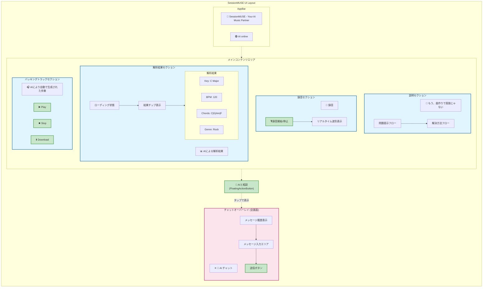
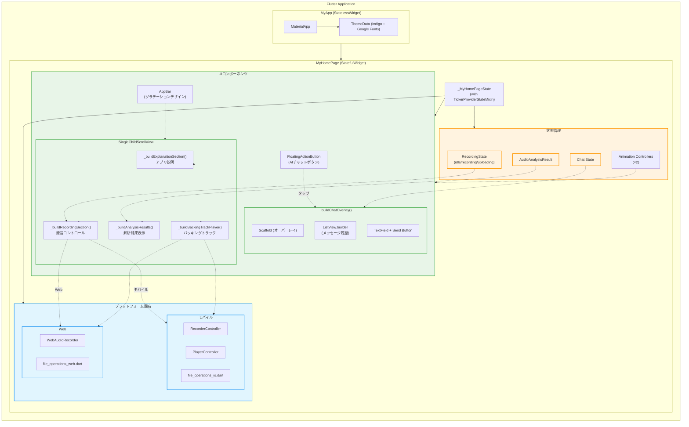
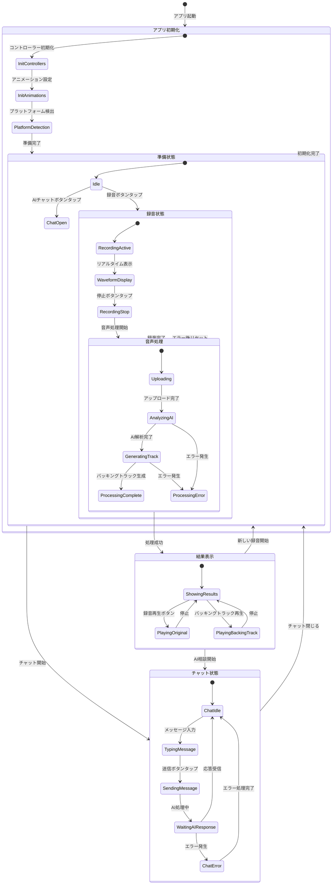
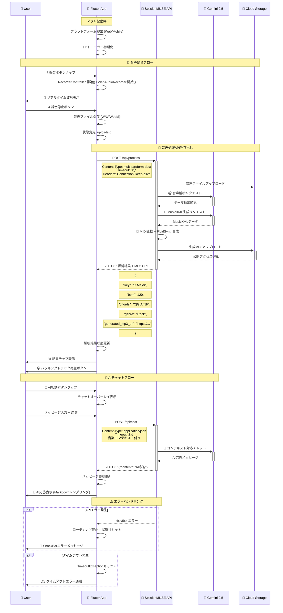
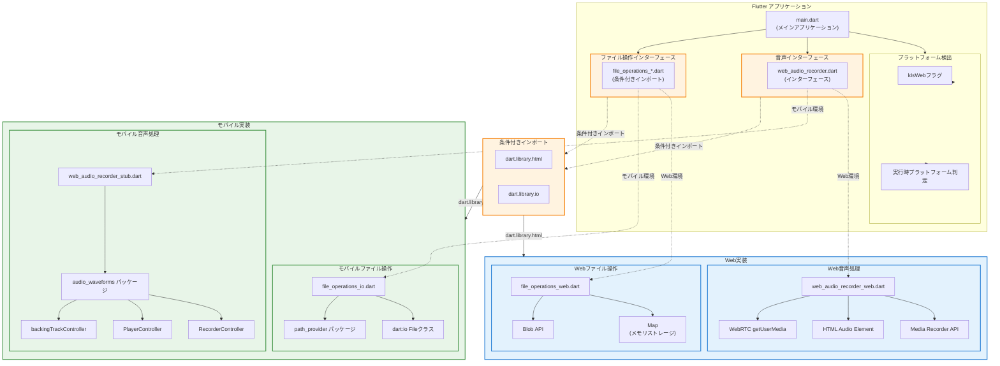

# SessionMUSE フロントエンド詳細設計書


## 1. はじめに
SessionMUSE フロントエンドアプリケーションの詳細な設計を定義するものです。実際のFlutterアプリケーションの実装に合わせて更新しています。


## 2. 設計方針
 * フレームワーク: Flutter を採用。iOS、Android、Webの全プラットフォームで単一コードベースによる開発を実現します。
 * UI構成: 全ての機能を単一ページに統合したシングルページアプリケーション構成。音声録音・解析、結果表示、AIチャット機能をメイン画面に配置し、ユーザーの直感的な操作を可能にします。
 * 状態管理: Flutterの `StatefulWidget` による局所状態管理を基本とし、ウィジェット間の状態共有は `setState` を使用した親子間でのプロパティ受け渡しで管理します。
 * スタイリング: Material Design を基調とし、カスタムテーマカラー（indigo系）を適用。コンポーネント単位でのスタイリングとデザインシステムの一貫性を確保します。
 * クロスプラットフォーム対応: Web/モバイル環境の差異を `dart:io`、`dart:html` の条件付きインポートで解決し、プラットフォーム固有の機能（録音・再生）を適切に分離します。


## 3. ディレクトリ構成
Flutter プロジェクトの標準的な構成に準拠し、責務に応じて以下のディレクトリ構成とします。
```text
/frontend/flutter_application
├── lib/
│   ├── main.dart                      # メインアプリケーション・UIコンポーネント
│   ├── web_audio_recorder.dart        # 音声録音インターフェース
│   ├── web_audio_recorder_web.dart    # Web環境用音声録音実装
│   ├── web_audio_recorder_stub.dart   # モバイル環境用スタブ
│   ├── file_operations_io.dart        # モバイル環境用ファイル操作
│   └── file_operations_web.dart       # Web環境用ファイル操作
├── pubspec.yaml                       # 依存関係定義
├── android/                           # Android固有設定
├── ios/                               # iOS固有設定
├── web/                               # Web固有設定・アセット
└── test/                              # テストファイル
    └── widget_test.dart
```


## 4. 画面・コンポーネント設計
### 4.1. 画面レイアウト構成
画面は説明セクション、メイン機能部分、および全画面オーバーレイのチャットエリアで構成されます。




### 4.2. UIコンポーネント階層構造

FlutterアプリケーションのUIコンポーネト階層と状態管理の関係を示します。



### 4.3. コンポーネント詳細
実装では単一の `MyHomePage` StatefulWidget 内に全機能を統合し、レスポンシブデザインとアニメーション対応を実現しています。

| ウィジェット/機能 | 内部状態 | 責務 |
|---|---|---|
| `_buildExplanationSection()` | - | アプリ紹介、価値提案、問題・解決フロー可視化 |
| `_buildRecordingSection()` | `_recordingState: RecordingState`<br>`_audioFilePath: String?` | 音声録音・停止処理、録音状態表示、リアルタイム波形表示 |
| `_buildAnalysisResults()` | `_analysisResult: AudioAnalysisResult?`<br>`_isRetrying: bool` | 音声解析結果表示、ローディング状態管理、結果チップ表示 |
| `_buildBackingTrackPlayer()` | `_isPlaying: bool`<br>`_isBackingTrackPlaying: bool`<br>`backingTrackController: PlayerController?` | 録音音声・バッキングトラック再生、ダウンロード機能 |
| `_buildChatOverlay()` | `_messages: List<ChatMessage>`<br>`_chatHistory: List<ChatMessageModel>`<br>`_isLoadingResponse: bool`<br>`_isChatOpen: bool`<br>`_scrollController: ScrollController` | 全画面チャットオーバーレイ、コンテキスト対応AI対話、履歴管理 |
| **アニメーション関連** | `_chatLoadingAnimationController`<br>`_progressAnimationController` | チャットローディング、プログレス表示アニメーション |
| **補助UI関連** | - | `_buildFlowStep()`, `_buildCustomLoadingAnimation()`, `_buildModernProgressBar()` 等 |


## 5. 状態管理設計 (_MyHomePageState)
アプリケーション全体の状態は `MyHomePage` の `StatefulWidget` 内で一元管理し、`TickerProviderStateMixin` によるアニメーション対応を実現しています。

### 5.1. 管理する状態 (State) - 最新実装版
```dart
class _MyHomePageState extends State<MyHomePage> with TickerProviderStateMixin {
  // UI制御
  RecordingState _recordingState = RecordingState.idle;  // 録音状態（idle/recording/uploading）
  bool _isPlaying = false;                               // 音声再生状態
  bool _isChatOpen = false;                              // チャット画面表示フラグ
  bool _isLoadingResponse = false;                       // AIチャット応答待ちフラグ
  bool _isBackingTrackPlaying = false;                   // バッキングトラック再生状態
  bool _shouldCancelAnalysis = false;                    // 解析キャンセルフラグ
  bool _isRetrying = false;                              // リトライ処理中フラグ
  bool _isPlayerPrepared = false;                        // プレイヤー準備状態
  bool _isApiAccessEnabled = false;                      // Android版API認証状態
  int _logoTapCount = 0;                                 // ロゴタップカウント

  // データ
  String? _audioFilePath;                                // 録音ファイルパス
  AudioAnalysisResult? _analysisResult;                  // 音声解析結果
  final List<ChatMessage> _messages = [];                // チャット表示用メッセージ
  final List<ChatMessageModel> _chatHistory = [];        // APIチャット履歴

  // コントローラークラス
  final TextEditingController _messageController = TextEditingController();
  final ScrollController _scrollController = ScrollController();
  
  // アニメーションコントローラー（2つのみ実装）
  late AnimationController _chatLoadingAnimationController; // チャットローディング
  late AnimationController _progressAnimationController;    // プログレス表示

  // 音声処理用コントローラー
  RecorderController? _recorderController;               // モバイル用録音
  PlayerController? playerController;                    // モバイル用再生
  PlayerController? backingTrackController;              // バッキングトラック用
  WebAudioRecorder? _webAudioRecorder;                  // Web用録音・再生
  
  // リスナー管理フラグ
  bool _playerListenerAdded = false;
  bool _backingTrackListenerAdded = false;

  // プラットフォーム検出
  bool get isWeb => kIsWeb;
  bool get isRecordingSupported => true;                 // Web版でも録音機能をサポート
}
```


### 5.2. 状態遷移フロー

アプリケーションの主要な状態遷移とユーザーアクションの関係を示します。



### 5.3. 更新処理メソッド
`setState()` メソッドで状態を更新し、アニメーションコントローラーで視覚的フィードバックを管理します。主要な状態更新タイミング：

**メイン機能関連**
 * `_handleRecordingButtonPress()`: 録音開始・停止時の状態更新とアニメーション制御
 * `_uploadAndAnalyze()`: 音声解析完了時の結果設定とプログレス更新
 * `_togglePlayback()`: 音声再生・停止時の状態更新
 * `_toggleBackingTrackPlayback()`: バッキングトラック再生制御

**チャット機能関連**
 * `_sendMessage()`: チャットメッセージ送信・受信時の状態更新とスクロール制御
 * `_toggleChat()`: チャット画面表示・非表示の切り替え

**アニメーション初期化 (initState)**
 * ローディングアニメーションコントローラーの設定
 * プラットフォーム別コントローラー初期化
 * リスナーの動的管理


## 6. API連携設計 (AudioProcessingService)
フロントエンドは以下のAPIエンドポイントと通信します。非同期処理には Dart の `http` パッケージを使用します。

### 6.0. API連携フロー全体図



### 6.1. 基本設定とAPIエンドポイント
音声処理サービスは以下のベースURLとエンドポイントを使用します：

```dart
class AudioProcessingService {
  static const String baseUrl = 'https://sessionmuse-backend-469350304561.us-east5.run.app';
  
  // エンドポイント
  static const String processEndpoint = '/api/process';
  static const String chatEndpoint = '/api/chat';
}
```

### 6.2. 音声処理API
 * エンドポイント: `POST /api/process`
 * 説明: 音声ファイルのアップロード、解析を一つのエンドポイントで処理します。
 * 実装: `uploadAndProcess()` メソッド（**3分タイムアウト設定**）
 * リクエスト:
   * Content-Type: `multipart/form-data`
   * Headers: `Connection: keep-alive` （長時間処理対応）
   * Body:
     * `file`: 音声ファイルデータ（モバイル：ファイルパス、Web：Uint8Listデータ）
     * Content-Type自動設定: `audio/wav` （デフォルト）、`audio/mpeg`、`audio/mp4`、`audio/aac`
 * レスポンス (成功時 200 OK):
   ```json
   {
     "key": "C Major",
     "bpm": 120,
     "chords": "C | G | Am | F",
     "genre": "Rock",
     "generated_mp3_url": "https://storage.googleapis.com/..." // バッキングトラックファイル
   }
   ```
 * データモデル:
   ```dart
   class AudioAnalysisResult {
     final String key;
     final int bpm;
     final String chords;
     final String genre;
     final String? backingTrackUrl;
   }
   ```


### 6.3. AIチャットAPI
 * エンドポイント: `POST /api/chat`
 * 説明: 現在のチャット履歴と音楽的文脈を送信し、AIからの応答を取得します。
 * 実装: `sendChatMessage()` メソッド（**2分タイムアウト設定**）
 * リクエスト:
   * Content-Type: `application/json`
   * Body:
     ```json
     {
       "messages": [
         { "role": "user", "content": "この曲に合う歌詞のテーマを考えて" }
         // ...過去の対話履歴
       ],
       "analysis_context": { // AIが音楽的文脈を理解するために付与（オプション）
         "key": "C Major",
         "bpm": 120,
         "chords": "C | G | Am | F",
         "genre": "Rock"
       }
     }
     ```
 * レスポンス (成功時 200 OK):
     ```json
     {
       "content": "切ない別れのシーンや、新しい旅立ちの希望をテーマにするのはいかがでしょうか？"
     }
     ```
 * データモデル:
   ```dart
   class ChatMessageModel {
     final String role;  // 'user' | 'assistant'
     final String content;
   }
   ```


### 6.4. APIレスポンス処理とエラーハンドリング

#### 6.4.1. AudioAnalysisResult データモデル
現在の実装では、新しいBackend APIレスポンス構造に対応したデータモデルを使用しています：

```dart
class AudioAnalysisResult {
  final String hummingTheme;      // 口ずさみから解析されたテーマ
  final String key;               // 楽曲のキー
  final int bpm;                  // テンポ
  final String chords;            // コード進行（List<String>から文字列に変換）
  final String genre;             // ジャンル
  final String? backingTrackUrl;  // バッキングトラックMusicXML URL
  final String? generatedMp3Url;  // 生成されたMP3ファイルURL
  final bool isRetried;           // リトライフラグ

  factory AudioAnalysisResult.fromJson(Map<String, dynamic> json) {
    final analysisData = json['analysis'] as Map<String, dynamic>?;
    
    return AudioAnalysisResult(
      hummingTheme: json['humming_theme'] ?? 'AI解析中...',
      key: analysisData?['key'] ?? 'Unknown',
      bpm: analysisData?['bpm'] ?? 0,
      chords: (analysisData?['chords'] as List<dynamic>?)?.join(' | ') ?? 'Unknown',
      genre: analysisData?['genre'] ?? 'Unknown',
      backingTrackUrl: json['backing_track_url'],
      generatedMp3Url: json['generated_mp3_url'],
    );
  }
}
```

#### 6.4.2. リトライ機能付き音声処理
実装では、音声処理の信頼性を高めるためリトライ機能を搭載：

```dart
static Future<AudioAnalysisResult?> uploadAndProcessWithRetry(
  String? filePath, {
  Uint8List? webAudioData,
  Function(bool)? onRetryStatusChanged,
}) async {
  // 初回処理試行
  final result = await uploadAndProcess(filePath, webAudioData: webAudioData);
  
  // MP3生成に失敗した場合のリトライロジック
  if (result != null && result.generatedMp3Url == null) {
    onRetryStatusChanged?.call(true);
    final retryResult = await uploadAndProcess(filePath, webAudioData: webAudioData);
    // ...
  }
}
```

## 7. パッケージ名とAndroid設定

### 7.1. アプリケーション識別情報
現在の実装では、以下のパッケージ名とアプリケーション設定を使用しています：

* **パッケージ名**: `com.sessionmuse.aimusic` (以前の `com.example.flutter_application` から変更)
* **アプリ名**: `Session MUSE`
* **バージョン**: `1.0.0` (ビルドコード: 1)

### 7.2. Android固有設定

#### 7.2.1. AndroidManifest.xml
```xml
<manifest xmlns:android="http://schemas.android.com/apk/res/android">
    <uses-permission android:name="android.permission.RECORD_AUDIO" />
    <application
        android:label="Session MUSE"
        android:name="${applicationName}"
        android:icon="@mipmap/ic_launcher">
        <!-- Activity設定 -->
    </application>
</manifest>
```

#### 7.2.2. build.gradle.kts設定
```kotlin
android {
    namespace = "com.sessionmuse.aimusic"
    compileSdk = flutter.compileSdkVersion
    
    defaultConfig {
        applicationId = "com.sessionmuse.aimusic"
        minSdk = 21
        targetSdk = flutter.targetSdkVersion
        versionCode = 1
        versionName = "1.0.0"
    }
}
```

### 7.3. デバッグ用スクリプト
Android実機テスト用のデバッグスクリプト (`debug_android.sh`) では、正しいパッケージ名を使用：

```bash
APP_PACKAGE="com.sessionmuse.aimusic"
```

## 8. プラットフォーム固有実装

### 8.0. プラットフォーム分岐アーキテクチャ

Flutterの条件付きインポートとプラットフォーム固有実装の関係を示します。



### 8.1. 音声録音・再生
 * **モバイル環境**: `audio_waveforms` パッケージの `RecorderController` / `PlayerController` を使用
   * リアルタイム波形表示対応
   * バッキングトラック用の別コントローラー (`backingTrackController`)
 * **Web環境**: 独自実装の `WebAudioRecorder` クラスでブラウザのMedia Recorder APIを使用
   * 音声ストリーム (`audioDataStream`) と再生状態ストリーム (`playbackStateStream`) 提供
   * URLからの直接音声再生対応 (`playAudioFromUrl`)
 * **条件付きインポート**: `dart.library.html` / `dart.library.io` での環境判定

### 8.2. ファイル操作とHTTP処理
 * **モバイル環境**: `dart:io` の `File` クラスで実ファイル操作
   * ファイル存在確認 (`fileExists`) とサイズ取得 (`getFileSize`) 機能
 * **Web環境**: メモリ上のファイル管理システム
   * `saveWebAudioFile` / `getWebAudioFile` 関数でメモリ上データ管理
 * **HTTP アップロード**: 拡張機能付き `createMultipartFileFromBytes`
   * ファイル拡張子に基づくContent-Type自動設定
   * WAV/MP3/M4A/AACフォーマット対応

### 8.3. レスポンシブデザイン
 * **Web環境**: 最大幅800pxのコンテナ制限でデスクトップ最適化
 * **モバイル環境**: 全幅活用でタッチインターフェース最適化
 * **プラットフォーム検出**: `kIsWeb` フラグで動的なUI切り替え

## 9. 新機能・改善点
### 9.1. UX改善機能
 * **アプリ説明セクション**: ユーザーの価値理解を支援する問題・解決フロー可視化
 * **リアルタイムフィードバック**: 録音中の波形表示、プログレスバー、ローディングアニメーション
 * **コンテキスト対応AI**: 音楽解析結果を含むチャット機能
 * **グラデーションデザイン**: 現代的な視覚デザインとシャドウ効果

### 9.2. 技術的改善
 * **アニメーションシステム**: 複数の `AnimationController` で滝らかなユーザー体験
 * **状態管理強化**: キャンセル機能、リスナー管理、メモリリーク防止
 * **エラーハンドリング強化**: タイムアウト管理、詳細ログ出力、ステータスコード対応
 * **国際化対応**: Google Fontsで日本語フォント最適化

## 10. 依存関係 (pubspec.yaml)
```yaml
dependencies:
  flutter: sdk: flutter
  cupertino_icons: ^1.0.8
  audio_waveforms: ^1.3.0      # 音声録音・再生・波形表示
  path_provider: ^2.1.2        # ファイルパス取得
  http: ^1.1.0                 # HTTP通信
  flutter_markdown: ^0.6.22    # Markdownレンダリング
  http_parser: ^4.1.2          # HTTP マルチパート処理
  google_fonts: ^6.1.0         # 日本語フォント（Noto Sans JP）
```
