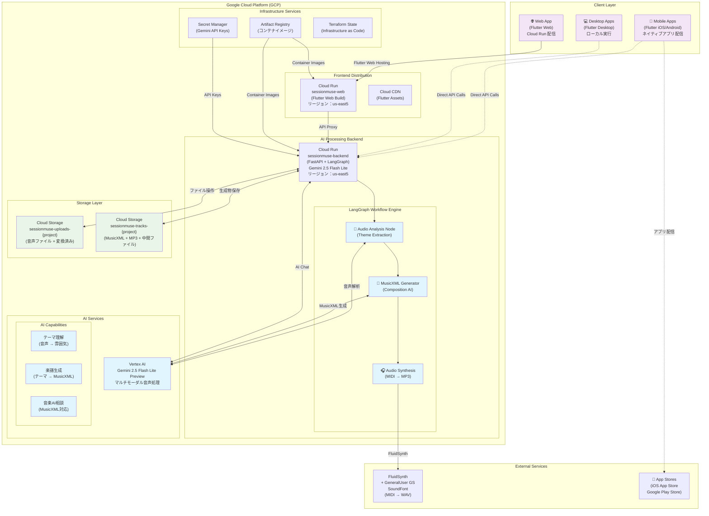
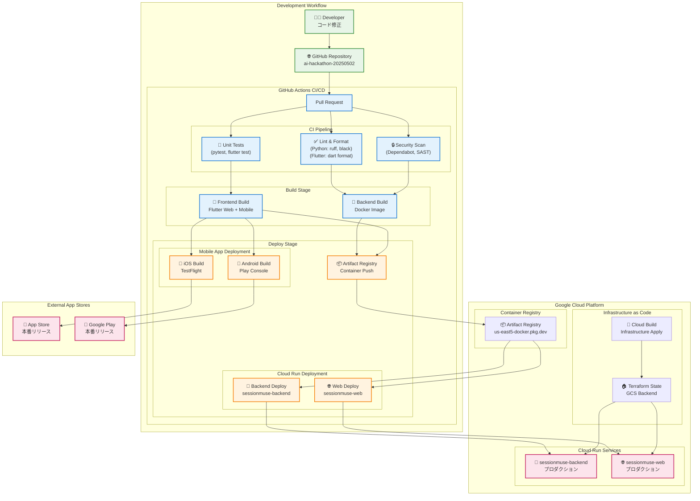
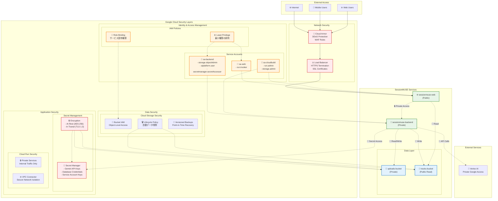
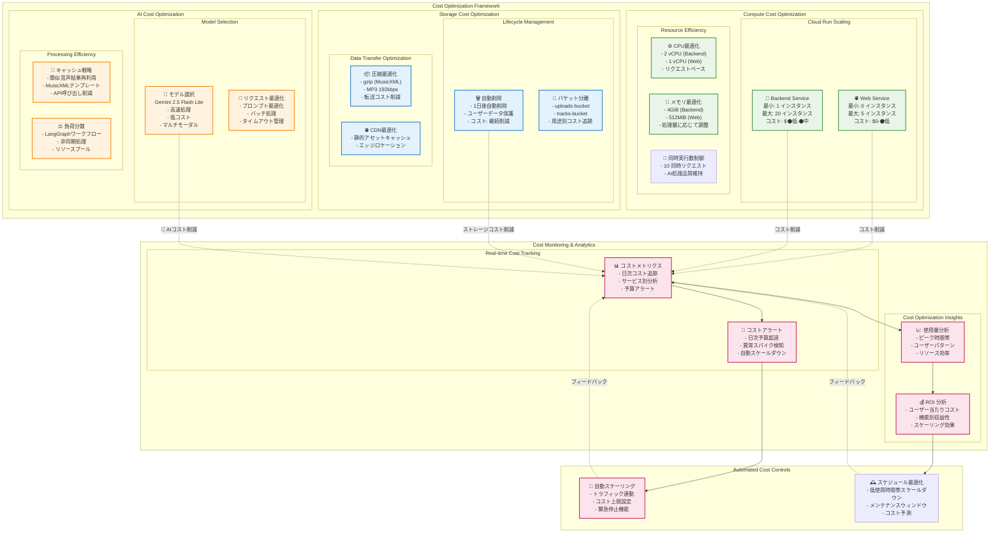
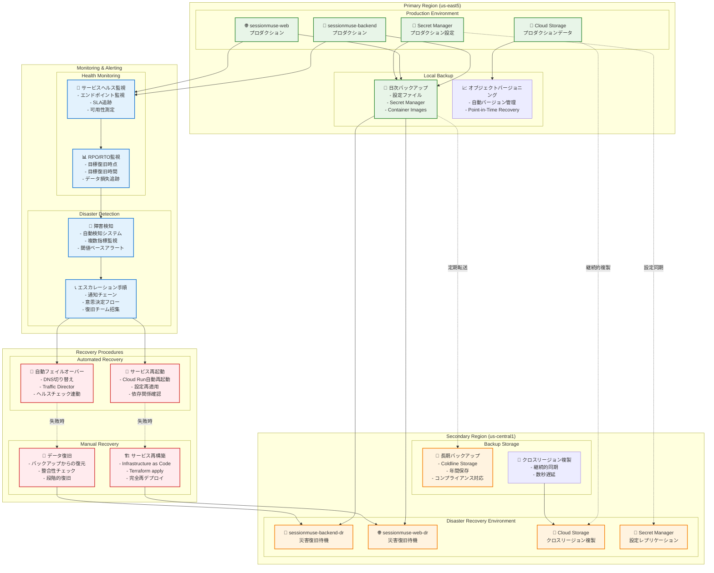

# SessionMUSE インフラストラクチャ詳細設計書 (UltraThink Edition)


## 1. はじめに


本ドキュメントは、「SessionMUSE」アプリケーションの次世代インフラ構成を定義します。Flutter マルチプラットフォームフロントエンドと、LangGraph + Gemini 2.5 による高度なAI音楽処理バックエンドを、Google Cloud Platform (GCP) 上で最適化・統合したアーキテクチャです。

### 1.1. UltraThink アプローチの特徴
- **マルチモーダル AI 処理**: Gemini 2.5 Flash Lite Preview による音声理解とMusicXML生成
- **ワークフロー駆動**: LangGraph による状態管理と非同期AI処理の制御
- **テーマベース音楽理解**: 従来のパラメータ抽出から人間的な音楽テーマ理解への進化
- **フルスタッククロスプラットフォーム**: Flutter による Web/iOS/Android 統一開発


## 2. UltraThink 全体構成図


SessionMUSE の革新的マルチプラットフォーム + AI 統合アーキテクチャ





## 2.1. CI/CDデプロイメントフロー

SessionMUSEの継続的インテグレーション・デプロイメントパイプラインを示します。



## 2.2. セキュリティアーキテクチャ

Google Cloudセキュリティベストプラクティスに基づいたIAM、ネットワーク、アクセス制御を示します。



## 3. 主要コンポーネント設計


### 3.1. フロントエンド配信戦略 (Flutter マルチプラットフォーム)

#### 3.1.1. Web アプリケーション (Cloud Run)

*   **サービス名**: `sessionmuse-web`
*   **リージョン**: `us-east5` (サウスカロライナ)
*   **テクノロジー**: Flutter Web ビルド + Nginxリバースプロキシ
*   **コンテナイメージ**: Flutter Web ビルド成果物を nginx で配信する軽量コンテナ
*   **サービスアカウント**: `sa-web@<project-id>.iam.gserviceaccount.com`
    *   バックエンドAPI呼び出しのための `roles/run.invoker` 権限
*   **インスタンス設定**:
    *   **最小インスタンス数**: 0 (コスト最適化)
    *   **最大インスタンス数**: 5 (Web トラフィック対応)
    *   **CPU**: 1 vCPU
    *   **メモリ**: 512MiB (静的配信なので軽量)
    *   **リクエストタイムアウト**: 30秒
*   **環境変数**:
    *   `BACKEND_API_ENDPOINT`: `https://sessionmuse-backend-xxxx.us-east5.run.app`
    *   `FLUTTER_WEB_BUILD_MODE`: `release`
*   **Dockerfile (Flutter Web最適化)**:
    ```dockerfile
    # 1. Flutter Web ビルドステージ
    FROM cirrusci/flutter:stable AS flutter-builder
    WORKDIR /app
    COPY frontend/flutter_application/ .
    RUN flutter config --enable-web
    RUN flutter pub get
    RUN flutter build web --release --web-renderer canvaskit

    # 2. Nginx 配信ステージ  
    FROM nginx:alpine AS runner
    RUN rm -rf /usr/share/nginx/html/*
    COPY --from=flutter-builder /app/build/web/ /usr/share/nginx/html/
    COPY frontend/nginx.conf.template /etc/nginx/conf.d/default.conf
    EXPOSE 80
    CMD ["nginx", "-g", "daemon off;"]
    ```

#### 3.1.2. モバイルアプリ配信

*   **iOS**: App Store Connect 経由でのエンタープライズ配信
    *   **ビルド環境**: GitHub Actions + Xcode Cloud 統合
    *   **署名**: Apple Developer Enterprise Account
    *   **配信方式**: TestFlight → App Store
*   **Android**: Google Play Console 経由での配信
    *   **ビルド環境**: GitHub Actions + Android Gradle Plugin
    *   **署名**: Google Play App Signing
    *   **配信方式**: Internal Testing → Production

#### 3.1.3. デスクトップアプリ配信

*   **Windows**: Microsoft Store / 直接配布
*   **macOS**: Mac App Store / 直接配布  
*   **Linux**: Snap Store / AppImage 配布


### 3.2. 次世代AIバックエンド (Cloud Run + LangGraph)

*   **サービス名**: `sessionmuse-backend`
*   **リージョン**: `us-east5` (サウスカロライナ)
*   **アーキテクチャ**: FastAPI + LangGraph ワークフロー + Gemini 2.5 Flash Lite Preview
*   **コンテナイメージ**: Python 3.11 + 音楽処理ライブラリ統合イメージ
*   **サービスアカウント**: `sa-backend@<project-id>.iam.gserviceaccount.com`
    *   **IAM ロール**:
        *   `roles/storage.objectAdmin`: マルチバケット GCS 操作
        *   `roles/aiplatform.user`: Vertex AI (Gemini 2.5) フルアクセス
        *   `roles/secretmanager.secretAccessor`: API キー管理
        *   `roles/cloudsql.client`: 将来的な永続化対応

#### 3.2.1. インスタンス設定 (UltraThink最適化)

*   **最小インスタンス数**: 1 (LangGraph ワークフロー初期化コスト軽減)
*   **最大インスタンス数**: 20 (並列AI処理対応)
*   **CPU**: 2 vCPU (音声変換 + AI並列処理)
*   **メモリ**: 4GiB (MusicXML生成 + FluidSynth + 複数音声フォーマット対応)
*   **リクエストタイムアウト**: 300秒 (複雑な音楽生成ワークフロー対応)
*   **同時実行数**: 10 (AI処理の品質確保)

#### 3.2.2. 環境変数 (新世代構成)

```bash
# GCS ストレージ管理
GCS_UPLOAD_BUCKET=sessionmuse-uploads-{project-id}
GCS_TRACK_BUCKET=sessionmuse-tracks-{project-id}
GCS_LIFECYCLE_DAYS=1

# Gemini 2.5 Flash Lite Preview
VERTEX_AI_LOCATION=global
ANALYZER_GEMINI_MODEL_NAME=gemini-2.5-flash-lite-preview-06-17
GENERATOR_GEMINI_MODEL_NAME=gemini-2.5-flash-lite-preview-06-17
CHAT_GEMINI_MODEL_NAME=gemini-2.5-flash-lite-preview-06-17
VERTEX_AI_TIMEOUT_SECONDS=120

# アプリケーション設定
LOG_LEVEL=INFO
MAX_FILE_SIZE_MB=100
PORT_LOCAL_DEV=8000

# 音楽処理設定
FLUIDSYNTH_SOUNDFONT_PATH=/app/GeneralUser GS v1.472.sf2
MUSIC_GENERATION_QUALITY=high
AUDIO_SYNTHESIS_FORMAT=mp3
```

#### 3.2.3. Dockerfile (AI音楽処理特化版)

```dockerfile
# 1. Python AI/音楽処理基盤
FROM python:3.11-slim AS base

# システム依存関係 (FluidSynth + 音声処理)
RUN apt-get update && apt-get install -y \
    fluidsynth \
    fluid-soundfont-gm \
    ffmpeg \
    libsndfile1 \
    && rm -rf /var/lib/apt/lists/*

# 2. Python依存関係インストール
WORKDIR /app
COPY backend/requirements.txt .
RUN pip install --no-cache-dir -r requirements.txt

# 3. SoundFont配置
COPY backend/GeneralUser\ GS\ v1.472.sf2 ./
COPY backend/ .

# 4. ヘルスチェック + 起動
EXPOSE 8080
ENV PORT=8080
HEALTHCHECK --interval=30s --timeout=10s --start-period=5s --retries=3 \
    CMD curl -f http://localhost:8080/health || exit 1

CMD ["uvicorn", "main:app", "--host", "0.0.0.0", "--port", "8080"]
```

#### 3.2.4. LangGraph ワークフロー設計

```python
# 音声処理ワークフロー (audio_analysis_service.py)
def create_audio_analysis_workflow():
    workflow = StateGraph(AudioAnalysisWorkflowState)
    
    # ノード定義
    workflow.add_node("analyze_humming", node_analyze_humming_audio)
    workflow.add_node("generate_musicxml", node_generate_musicxml)
    workflow.add_node("handle_analysis_error", node_handle_analysis_error)
    workflow.add_node("handle_generation_error", node_handle_generation_error)
    
    # フロー制御
    workflow.set_entry_point("analyze_humming")
    workflow.add_conditional_edges(
        "analyze_humming",
        should_proceed_to_generation,
        {
            "continue": "generate_musicxml", 
            "error": "handle_analysis_error"
        }
    )
    
    return workflow.compile()
```


### 3.3. ストレージ (Cloud Storage)


*   **バケット**:
    *   `sessionmuse-uploads-your-project-id` (ユーザーのアップロード音声用)
    *   `sessionmuse-tracks-your-project-id` (AIが生成したバッキングトラック用)
*   **ロケーション**: `us-east5` (サウスカロライナ)
*   **ストレージクラス**: Standard (頻繁なアクセスを想定)
*   **アクセス制御 (IAM)**:
    *   バックエンドCloud Runのサービスアカウント (`sa-backend@<project-id>.iam.gserviceaccount.com`) に対して、両バケットの **ストレージオブジェクト管理者** (`roles/storage.objectAdmin`) ロールを付与します。
*   **ライフサイクル管理**:
    *   **ルール**: オブジェクト作成から 1日 後にオブジェクトを自動的に削除するルールを両バケットに設定します。これにより、ストレージコストを抑制し、不要なユーザーデータを保持しません。


### 3.4. シークレット管理 (Secret Manager)
*   **目的**: Gemini APIキーなどの機密情報を安全に保管し、バックエンドアプリケーションからセキュアにアクセスします。
*   **アクセス制御 (IAM)**:
    *   バックエンドCloud Runのサービスアカウント (`sa-backend@<project-id>.iam.gserviceaccount.com`) に対して、対象シークレットへの **Secret Manager シークレットアクセサー** (`roles/secretmanager.secretAccessor`) ロールを付与します。


## 4. UltraThink AI処理パイプライン

### 4.1. Gemini 2.5 Flash Lite Preview 統合

*   **マルチモーダル処理**: 音声ファイルを直接Geminiに送信し、テーマとMusicXMLを同時生成
*   **コンテキスト理解**: 口ずさみから「明るくエネルギッシュなJ-POP風」等の人間的表現を抽出
*   **楽譜生成**: テーマベースでMusicXMLを構造化生成、従来のMIDI生成を超越

### 4.2. LangGraph ワークフロー管理

```python
# 状態管理型AI処理
class AudioAnalysisWorkflowState(TypedDict):
    gcs_file_path: str
    workflow_run_id: Optional[str]
    humming_analysis_theme: Optional[str]  # テーマ抽出結果
    generated_musicxml_data: Optional[str]  # MusicXML生成結果
    final_analysis_result: Optional[AnalysisResult]
```

*   **エラーハンドリング**: ノード単位での例外処理と状態復旧
*   **非同期実行**: AI処理の並列化とタイムアウト管理
*   **監視可能性**: ワークフロー実行状況のリアルタイム追跡

### 4.3. 音楽合成パイプライン

```
音声アップロード → WebM/AAC→WAV変換 → Gemini解析 → テーマ抽出
                                                    ↓
MP3配信 ← FluidSynth合成 ← MIDI変換 ← MusicXML生成 ← Gemini生成
```

## 5. モニタリング・オブザーバビリティ

SessionMUSE の包括的な監視システムとGoogle Cloudオペレーションスイート統合を示します。

### 5.0. 統合モニタリングアーキテクチャ

```mermaid
flowchart TD
    subgraph "SessionMUSE Application Layer"
        direction TB
        
        subgraph "Frontend Monitoring"
            FlutterApp["📱 Flutter Apps\n(Web + Mobile)"]
            UserMetrics["📈 User Metrics\n- Page Views\n- Session Duration\n- User Actions"]
            PerformanceMetrics["⚡ Performance\n- App Load Time\n- API Response Time\n- Error Rates"]
        end
        
        subgraph "Backend Monitoring"
            CloudRunBackend["🚀 Cloud Run Backend"]
            
            subgraph "Application Metrics"
                CustomMetrics["📊 Custom Metrics\n- audio_processing_duration\n- musicxml_generation_success_rate\n- gemini_api_latency"]
                BusinessMetrics["💼 Business Metrics\n- Daily Active Users\n- Audio Uploads\n- AI Conversations"]
            end
            
            subgraph "Technical Metrics"
                SystemMetrics["🖥️ System Metrics\n- CPU/Memory Usage\n- Request Latency\n- Throughput"]
                ErrorMetrics["⚠️ Error Metrics\n- HTTP Status Codes\n- Exception Rates\n- LangGraph Failures"]
            end
        end
    end
    
    subgraph "Google Cloud Operations Suite"
        direction TB
        
        subgraph "Logging"
            CloudLogging["📋 Cloud Logging"]
            
            subgraph "Log Types"
                StructuredLogs["📝 Structured Logs\n- JSON Format\n- Correlation IDs\n- Request Tracing"]
                ApplicationLogs["📱 Application Logs\n- FastAPI Logs\n- LangGraph Execution\n- AI Processing Steps"]
                SecurityLogs["🔒 Security Logs\n- Authentication\n- Authorization\n- Audit Trail"]
            end
        end
        
        subgraph "Monitoring"
            CloudMonitoring["📈 Cloud Monitoring"]
            
            subgraph "Metrics Collection"
                ResourceMetrics["📊 Resource Metrics\n- Cloud Run Metrics\n- GCS Metrics\n- Vertex AI Metrics"]
                CustomDashboards["📊 Custom Dashboards\n- AI Processing Pipeline\n- User Experience\n- System Health"]
            end
            
            subgraph "Alerting"
                AlertPolicies["🚨 Alert Policies\n- AI Failure Rate > 5%\n- Response Time > 30s\n- Error Rate > 1%"]
                NotificationChannels["📧 Notifications\n- Email Alerts\n- Slack Integration\n- PagerDuty (Production)"]
            end
        end
        
        subgraph "Tracing"
            CloudTrace["🔍 Cloud Trace"]
            
            subgraph "Distributed Tracing"
                RequestTracing["🔗 Request Tracing\n- Frontend → Backend\n- LangGraph Workflow\n- Vertex AI Calls"]
                PerformanceInsights["🔍 Performance Insights\n- Bottleneck Detection\n- Latency Analysis\n- Dependency Mapping"]
            end
        end
        
        subgraph "Error Reporting"
            ErrorReporting["🚨 Error Reporting"]
            ErrorAggregation["📈 Error Aggregation\n- Exception Grouping\n- Impact Analysis\n- Resolution Tracking"]
        end
    end
    
    subgraph "External Integrations"
        direction LR
        
        subgraph "AI Monitoring"
            VertexMonitoring["🤖 Vertex AI Monitoring\n- Model Performance\n- API Usage\n- Cost Tracking"]
        end
        
        subgraph "Third-party Tools"
            Sentry["🚨 Sentry\n(Optional)\nReal-time Error Tracking"]
            DataStudio["📊 Google Data Studio\n- Business Dashboards\n- User Analytics"]
        end
    end
    
    %% Data Flow
    FlutterApp --> UserMetrics
    FlutterApp --> PerformanceMetrics
    CloudRunBackend --> CustomMetrics
    CloudRunBackend --> BusinessMetrics
    CloudRunBackend --> SystemMetrics
    CloudRunBackend --> ErrorMetrics
    
    %% Logging Flow
    FlutterApp -.->|"📋 Logs"| CloudLogging
    CloudRunBackend -.->|"📋 Logs"| CloudLogging
    CloudLogging --> StructuredLogs
    CloudLogging --> ApplicationLogs
    CloudLogging --> SecurityLogs
    
    %% Monitoring Flow
    CustomMetrics --> CloudMonitoring
    SystemMetrics --> CloudMonitoring
    CloudMonitoring --> ResourceMetrics
    CloudMonitoring --> CustomDashboards
    
    %% Alerting Flow
    CloudMonitoring --> AlertPolicies
    AlertPolicies --> NotificationChannels
    
    %% Tracing Flow
    CloudRunBackend -.->|"🔍 Traces"| CloudTrace
    CloudTrace --> RequestTracing
    CloudTrace --> PerformanceInsights
    
    %% Error Handling
    ErrorMetrics --> ErrorReporting
    ErrorReporting --> ErrorAggregation
    
    %% External Integrations
    CloudRunBackend -.-> VertexMonitoring
    ErrorReporting -.-> Sentry
    CloudMonitoring -.-> DataStudio
    
    classDef appStyle fill:#e8f5e8,stroke:#388e3c,stroke-width:2px
    classDef monitoringStyle fill:#e3f2fd,stroke:#1976d2,stroke-width:2px
    classDef alertStyle fill:#ffebee,stroke:#d32f2f,stroke-width:2px
    classDef externalStyle fill:#fff3e0,stroke:#f57c00,stroke-width:2px
    
    class FlutterApp,CloudRunBackend appStyle
    class CloudLogging,CloudMonitoring,CloudTrace monitoringStyle
    class AlertPolicies,NotificationChannels,ErrorReporting alertStyle
    class VertexMonitoring,Sentry,DataStudio externalStyle
```



### 5.1. 構造化ログ戦略

*   **相関ID追跡**: X-Request-ID によるリクエスト全体の追跡
*   **ワークフロー監視**: LangGraph ノード実行状況の詳細ログ
*   **AI処理メトリクス**: Gemini API呼び出し時間・成功率・エラー分類

### 5.2. Cloud Monitoring 統合

*   **カスタムメトリクス**:
    *   `sessionmuse/audio_processing_duration`: 音声処理時間
    *   `sessionmuse/musicxml_generation_success_rate`: MusicXML生成成功率
    *   `sessionmuse/gemini_api_latency`: Gemini API応答時間
*   **アラート設定**:
    *   AI処理失敗率 > 5%
    *   平均応答時間 > 30秒
    *   Gemini APIエラー率 > 1%

### 5.3. 分散トレーシング

*   **Cloud Trace**: リクエスト→ワークフロー→AI処理の完全な経路追跡
*   **LangGraph統合**: 各ワークフローノードのスパン生成
*   **外部API追跡**: Vertex AI呼び出しのトレース情報

## 6. コスト最適化 (UltraThink版)

### 6.0. コスト最適化戦略全体図

SessionMUSEの包括的なコスト最適化アプローチとリソース管理を示します。



### 6.1. インテリジェントスケーリング

*   **Flutter Web**: 最小インスタンス数 0 (静的配信)
*   **Backend**: 最小インスタンス数 1 (ワームアップコスト削減)
*   **AI処理**: 同時実行数制限でリソース効率化

### 6.2. ストレージライフサイクル

*   **自動削除**: アップロード・生成ファイル1日後削除
*   **バケット分離**: 用途別コスト追跡
*   **圧縮配信**: MusicXML/MP3 gzip圧縮

### 6.3. AI API最適化

*   **モデル選択**: Flash Lite Preview (高速・低コスト)
*   **バッチ処理**: 複数リクエストの統合処理
*   **キャッシュ戦略**: 類似音声の結果再利用


## 7. 災害復旧・バックアップ戦略

SessionMUSEの事業継続性とデータ保護のための包括的な災害復旧戦略を示します。

### 7.0. 災害復旧アーキテクチャ全体図



### 7.1. 復旧目標設定

*   **RPO (Recovery Point Objective)**: 1時間以内
    *   ユーザーデータの最大許容損失時間
    *   継続的クロスリージョン複製による実現
*   **RTO (Recovery Time Objective)**: 15分以内
    *   サービス復旧までの最大許容時間
    *   自動フェイルオーバーによる実現

### 7.2. バックアップ戦略

*   **データ分類**:
    *   **クリティカル**: Secret Manager、コンテナイメージ、設定
    *   **重要**: ユーザーアップロードファイル（1日保存）
    *   **一時的**: AIで生成されたMP3ファイル（1日保存）

*   **バックアップスケジュール**:
    *   **日次**: 全設定・シークレット・イメージバックアップ
    *   **継続**: ストレージオブジェクトのクロスリージョン複製
    *   **週次**: 長期保存用バックアップ作成


## 8. API Rate Limiting・スロットリング戦略

SessionMUSEのAPIエンドポイントのトラフィック制御と品質保証のためのrate limiting戦略を示します。

### 8.0. API Rate Limiting アーキテクチャ

```mermaid
flowchart TD
    subgraph "Client Layer"
        direction LR
        MobileClient["📱 Mobile Clients"]
        WebClient["🌐 Web Clients"]
        DesktopClient["💻 Desktop Clients"]
    end
    
    subgraph "Google Cloud Frontend"
        direction TB
        
        subgraph "Traffic Management"
            CloudArmor["🛑 Cloud Armor\n- DDoS Protection\n- IP-based Rate Limiting\n- Geo-filtering"]
            LoadBalancer["⚖️ Load Balancer\n- Request Distribution\n- Health Checks\n- SSL Termination"]
        end
        
        subgraph "API Gateway Layer"
            APIGateway["🚪 API Gateway\n(Cloud Endpoints)\n- Rate Limiting\n- Authentication\n- Request Validation"]
            
            subgraph "Rate Limiting Rules"
                GlobalLimits["🌐 Global Limits\n- 1000 req/min per IP\n- 10000 req/hour per IP"]
                UserLimits["👤 User-based Limits\n- 50 audio uploads/day\n- 200 chat messages/hour"]
                EndpointLimits["🎯 Endpoint-specific\n- /api/process: 10/min\n- /api/chat: 30/min"]
            end
        end
    end
    
    subgraph "SessionMUSE Backend Services"
        direction TB
        
        subgraph "Application Layer Rate Limiting"
            FastAPI["🚀 FastAPI Application"]
            
            subgraph "Middleware Stack"
                RateLimitMiddleware["🔒 Rate Limit Middleware\n- slowapi (Redis-backed)\n- User identification\n- Custom rate limits"]
                AuthMiddleware["🔑 Authentication Middleware\n- User context\n- Permission checks"]
                LoggingMiddleware["📋 Logging Middleware\n- Request tracking\n- Rate limit events"]
            end
        end
        
        subgraph "Resource Protection"
            direction LR
            
            subgraph "AI Processing Protection"
                GeminiLimiting["🤖 Gemini API Limiting\n- 5 concurrent requests\n- 2-minute timeout\n- Queue management"]
                LangGraphThrottling["🔄 LangGraph Throttling\n- Workflow prioritization\n- Resource pooling\n- Backpressure handling"]
            end
            
            subgraph "Storage Protection"
                GCSLimiting["📁 GCS Rate Limiting\n- Upload size limits\n- Bandwidth throttling\n- Concurrent upload control"]
                TempFileCleanup["🗑️ Temporary File Cleanup\n- Immediate cleanup\n- Memory management\n- Disk space protection"]
            end
        end
    end
    
    subgraph "Rate Limiting Storage"
        direction LR
        
        Redis["📊 Redis\n(Cloud Memorystore)\n- Rate limit counters\n- Sliding window\n- Fast lookup"]
        
        subgraph "Counter Types"
            IPCounters["🌐 IP-based Counters\n- Requests per minute\n- Requests per hour\n- Sliding window"]
            UserCounters["👤 User-based Counters\n- Feature usage\n- Daily quotas\n- Premium tiers"]
            EndpointCounters["🎯 Endpoint Counters\n- Per-endpoint limits\n- Resource-specific\n- Priority levels"]
        end
    end
    
    subgraph "Response Strategies"
        direction TB
        
        subgraph "Rate Limit Responses"
            HTTP429["❌ HTTP 429\nToo Many Requests\n- Retry-After header\n- Helpful error message"]
            GracefulDegradation["⚖️ Graceful Degradation\n- Queue requests\n- Reduced functionality\n- Alternative responses"]
        end
        
        subgraph "User Communication"
            RateLimitHeaders["📊 Rate Limit Headers\n- X-RateLimit-Limit\n- X-RateLimit-Remaining\n- X-RateLimit-Reset"]
            UIIndicators["📱 UI Indicators\n- Progress bars\n- Rate limit warnings\n- Retry suggestions"]
        end
    end
    
    %% Request Flow
    MobileClient --> CloudArmor
    WebClient --> CloudArmor
    DesktopClient --> CloudArmor
    
    CloudArmor --> LoadBalancer
    LoadBalancer --> APIGateway
    
    %% Rate Limiting Application
    APIGateway --> GlobalLimits
    APIGateway --> UserLimits
    APIGateway --> EndpointLimits
    
    %% Backend Processing
    APIGateway --> FastAPI
    FastAPI --> RateLimitMiddleware
    RateLimitMiddleware --> AuthMiddleware
    AuthMiddleware --> LoggingMiddleware
    
    %% Resource Protection
    LoggingMiddleware --> GeminiLimiting
    LoggingMiddleware --> LangGraphThrottling
    LoggingMiddleware --> GCSLimiting
    LoggingMiddleware --> TempFileCleanup
    
    %% Storage Operations
    RateLimitMiddleware -.->|"カウンター更新"| Redis
    Redis --> IPCounters
    Redis --> UserCounters
    Redis --> EndpointCounters
    
    %% Response Handling
    RateLimitMiddleware --> HTTP429
    RateLimitMiddleware --> GracefulDegradation
    
    FastAPI --> RateLimitHeaders
    RateLimitHeaders --> UIIndicators
    
    %% Error Flow
    HTTP429 -.->|"レート制限時"| UIIndicators
    GracefulDegradation -.->|"代替応答"| UIIndicators
    
    classDef clientStyle fill:#e8f5e8,stroke:#388e3c,stroke-width:2px
    classDef gatewayStyle fill:#e3f2fd,stroke:#1976d2,stroke-width:2px
    classDef appStyle fill:#fff3e0,stroke:#f57c00,stroke-width:2px
    classDef storageStyle fill:#fce4ec,stroke:#c2185b,stroke-width:2px
    
    class MobileClient,WebClient,DesktopClient clientStyle
    class CloudArmor,LoadBalancer,APIGateway,GlobalLimits,UserLimits,EndpointLimits gatewayStyle
    class FastAPI,RateLimitMiddleware,AuthMiddleware,LoggingMiddleware,GeminiLimiting appStyle
    class Redis,IPCounters,UserCounters,EndpointCounters storageStyle
```



### 8.1. Rate Limiting 設定

*   **グローバル制限**:
    *   IP当たり: 1000リクエスト/分
    *   IP当たり: 10000リクエスト/時間

*   **エンドポイント別制限**:
    *   `/api/process`: 10リクエスト/分（AI処理負荷考慮）
    *   `/api/chat`: 30リクエスト/分（対話性重視）
    *   `/health`: 制限なし（監視用）

### 8.2. ユーザー別制限

*   **Free Tier**:
    *   音声アップロード: 50回/日
    *   AIチャット: 200メッセージ/時間

*   **Premium Tier** (将来実装):
    *   音声アップロード: 500回/日
    *   AIチャット: 1000メッセージ/時間

### 8.3. 品質保証戦略

*   **Circuit Breaker**: AI処理の高負荷時の自動停止
*   **Graceful Degradation**: 部分機能提供での継続サービス
*   **Queue Management**: 優先度付きリクエスト処理
