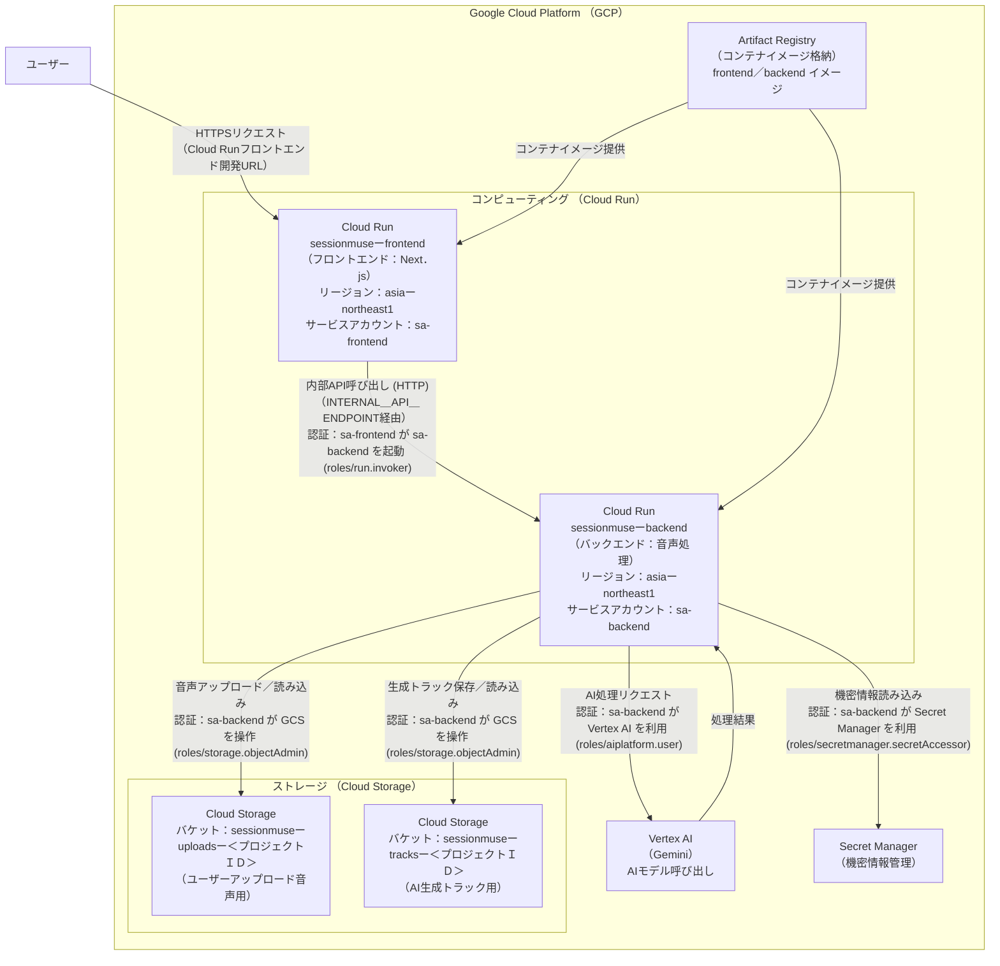

# SessionMUSE インフラストラクチャ詳細設計書


## 1. はじめに


本ドキュメントは、「SessionMUSE」アプリケーションのフロントエンドおよびバックエンドをすべてGoogle Cloud Platform (GCP) 上のCloud Runで構築し、安定稼働させるためのインフラ構成です。


## 2. 全体構成図


ユーザーからのリクエストは、Cloud Runの開発URLで受け付けます。





## 3. 主要コンポーネント設計


### 3.1. フロントエンドコンピュート (Cloud Run)


*   **サービス名**: `sessionmuse-frontend`
*   **リージョン**: `asia-northeast1` (東京)
*   **コンテナイメージ**: Next.jsのstandalone出力モードを利用してビルドしたDockerイメージをArtifact Registryからデプロイします。
*   **サービスアカウント**: `sa-frontend@<project-id>.iam.gserviceaccount.com` (専用に作成)
    *   このサービスアカウントには、バックエンドCloud Runサービス (`sessionmuse-backend`) を呼び出すためのIAMロール `roles/run.invoker` を付与します。
*   **インスタンス設定**:
    *   **最小インスタンス数**: 0 (リクエストがない時間帯はコストをゼロにする)
    *   **最大インスタンス数**: 1 (トラフィックの急増に対応する上限)
    *   **CPU**: 1 vCPU
    *   **メモリ**: 1GiB
    *   **リクエストタイムアウト**: 30秒
*   **環境変数**:
    *   `NEXT_PUBLIC_API_ENDPOINT`: `https://sessionmuse-frontend-xxxx-an.a.run.app` (フロントエンドCloud Runサービスの公開開発URL。ユーザーが直接アクセスするURL)
    *   `INTERNAL_API_ENDPOINT`: `http://sessionmuse-backend-xxxx-an.a.run.app` (Next.jsサーバーサイドからバックエンドAPIを直接呼び出すためのバックエンドCloud Runサービスの開発URL。サービスディスカバリ経由)
*   **Dockerfile (例)**:
    ```dockerfile
    # 1. ビルドステージ
    FROM node:20-alpine AS builder
    WORKDIR /app
    COPY . .
    RUN npm install
    RUN npm run build


    # 2. 実行ステージ
    FROM node:20-alpine AS runner
    WORKDIR /app
    ENV NODE_ENV production
    COPY --from=builder /app/public ./public
    COPY --from=builder --chown=node:node /app/.next/standalone ./
    COPY --from=builder --chown=node:node /app/.next/static ./.next/static
    USER node
    EXPOSE 3000
    ENV PORT 3000
    CMD ["node", "server.js"]
    ```


### 3.2. バックエンドコンピュート (Cloud Run)


*   **サービス名**: `sessionmuse-backend`
*   **リージョン**: `asia-northeast1` (東京)
*   **コンテナイメージ**: Artifact Registryからデプロイ (`asia-northeast1-docker.pkg.dev/your-project-id/sessionmuse/backend:latest`)
*   **サービスアカウント**: `sa-backend@<project-id>.iam.gserviceaccount.com` (専用に作成)
    *   このサービスアカウントには以下のIAMロールを付与します:
        *   `roles/storage.objectAdmin`: Cloud Storageバケットへの読み書きアクセス用。
        *   `roles/aiplatform.user`: Vertex AI (Gemini) の利用権限。
        *   `roles/secretmanager.secretAccessor`: Secret Managerからのシークレット読み取り権限。
*   **インスタンス設定**:
    *   **最小インスタンス数**: 0
    *   **最大インスタンス数**: 10
    *   **CPU**: 1 vCPU
    *   **メモリ**: 2GiB (音声処理ライブラリ `librosa` や `pydub` がメモリを消費するため、デフォルトより多めに確保)
    *   **リクエストタイムアウト**: 60秒 (Gemini APIの応答や音声処理に要する時間を考慮)
*   **環境変数とシークレット**:
    *   `GCS_UPLOAD_BUCKET`: `sessionmuse-uploads-your-project-id` (ユーザーアップロード用バケット名)
    *   `GCS_TRACK_BUCKET`: `sessionmuse-tracks-your-project-id` (AI生成トラック用バケット名)
    *   `GEMINI_API_KEY_SECRET_NAME`: Secret Managerに格納されたGemini APIキーのシークレット名 (例: `projects/YOUR_PROJECT_ID/secrets/GEMINI_API_KEY/versions/latest`)
    *   `GEMINI_MODEL_NAME`: (例: `gemini-1.5-pro-latest`)
    *   `LOG_LEVEL`: (例: `INFO`)
    *   `SIGNED_URL_EXPIRATION_SECONDS`: (例: `3600`)
    *   `GCS_LIFECYCLE_DAYS`: (例: `1`)
    *   `MAX_FILE_SIZE_MB`: (例: `100`)
*   **Ingress制御**:
    *   「内部」トラフィックのみを許可: フロントエンドCloud Runサービス (`sessionmuse-frontend`) からの呼び出しのみを許可します。これは、フロントエンドサービスアカウント (`sa-frontend`) がこのバックエンドサービスを呼び出す権限 (`roles/run.invoker`) を持つことで実現されます。
    *   インターネットからの直接アクセスは許可しません（開発目的でCloud Runが提供する開発URLは存在しますが、認証により保護されます）。


### 3.3. ストレージ (Cloud Storage)


*   **バケット**:
    *   `sessionmuse-uploads-your-project-id` (ユーザーのアップロード音声用)
    *   `sessionmuse-tracks-your-project-id` (AIが生成したバッキングトラック用)
*   **ロケーション**: `asia-northeast1` (東京)
*   **ストレージクラス**: Standard (頻繁なアクセスを想定)
*   **アクセス制御 (IAM)**:
    *   バックエンドCloud Runのサービスアカウント (`sa-backend@<project-id>.iam.gserviceaccount.com`) に対して、両バケットの **ストレージオブジェクト管理者** (`roles/storage.objectAdmin`) ロールを付与します。
*   **ライフサイクル管理**:
    *   **ルール**: オブジェクト作成から 1日 後にオブジェクトを自動的に削除するルールを両バケットに設定します。これにより、ストレージコストを抑制し、不要なユーザーデータを保持しません。


### 3.4. シークレット管理 (Secret Manager)
*   **目的**: Gemini APIキーなどの機密情報を安全に保管し、バックエンドアプリケーションからセキュアにアクセスします。
*   **アクセス制御 (IAM)**:
    *   バックエンドCloud Runのサービスアカウント (`sa-backend@<project-id>.iam.gserviceaccount.com`) に対して、対象シークレットへの **Secret Manager シークレットアクセサー** (`roles/secretmanager.secretAccessor`) ロールを付与します。


## 4. コスト最適化


*   **Cloud Run**: 両方のサービスで最小インスタンス数を `0` に設定することで、リクエストがない非アクティブ時間帯のコンピュートコストを最小化します。
*   **Cloud Storage**: ライフサイクルポリシーを適用し、アップロードされた一時ファイルを短期間（1日）で自動削除することで、ストレージコストの継続的な増大を防ぎます。
*   **ネットワーク**: 利用するGCPサービスはすべて同一リージョン (`asia-northeast1`) に統一し、リージョン間の不要なデータ転送料金の発生を回避します。
