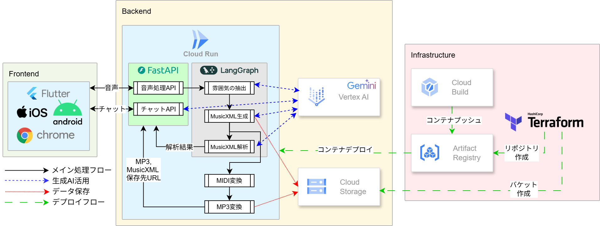

# もう、曲作りで孤独じゃない。AIパートナー「Session MUSE」と創る音楽

## はじめに：創造的な孤独に寄り添うパートナー

音楽制作、特に作曲やアレンジのプロセスは、しばしば孤独な探求の旅です。ふと浮かんだメロディ、心に響いたギターリフ。その小さなアイデアの種を、一つの楽曲へと育て上げる過程で、多くのクリエイターが「創造的な孤独」という壁に直面します。

「この方向性で合っているのだろうか？」  
「アイデアが枯渇して、次の一手が見えない…」

バンドメンバーやプロデューサーがいれば得られる客観的なフィードバックや、予期せぬインスピレーション。誰もがその環境に恵まれているわけではありません。

この、すべてのミュージシャンが抱える普遍的な課題を解決するため、私たちはAI音楽パートナー「Session MUSE」を開発しました。Session MUSEは単なるツールではありません。それは、あなたの創造性に火を灯し、24時間365日、いつでもあなたのアイデアに付き合ってくれる最高のバンドメンバーです。

**鼻歌から、AIと一緒に作り上げる、世界で唯一無二の作品**

ユーザーがアップロードした鼻歌や楽器の演奏をAIが聴き、その音楽的意図を理解し、即座にバッキングトラックを生成し、対話を通じて次の展開を一緒に考えてくれます。

本記事は、第2回 AI Agent Hackathon with Google Cloud への応募作品として開発した「Session MUSE」のアイデアと、それを支える技術的な挑戦、そして実装から得られた学びと成果について詳しく紹介するものです。

🏆 **プロジェクトの成果概要**
- Google Gemini 2.5 Flash Lite Previewの可能性を解放:　マルチモーダル機能を活用し、「鼻歌から直接楽曲制作」AIを実現
- 堅牢かつ柔軟なアーキテクチャ: Cloud RunとLangGraphによる完全サーバーレス・ワークフロー駆動型アーキテクチャを実現
- クロスプラットフォーム開発: Flutterにより、一度の開発で多くのユーザーに届けられるアプリケーションを実現。

## ⅰ. プロジェクトが対象とするユーザー像と課題、ソリューションと特徴

### 対象ユーザーと、すべての創造者がぶつかる「壁」

Session MUSEが対象とするのは、自宅の部屋で黙々と楽曲制作に打ち込む「ベッドルーム・プロデューサー」、個人で活動するミュージシャン、作曲を学ぶ学生、そして趣味で音楽を創るすべての人々です。彼らは情熱と才能に溢れていますが、共通して創作プロセスの中で行き詰まりを経験します。

### 創作における行き詰まりの流れ

💭 **アイデアが浮かんだ** → 😕 **一人だと行き詰まり** → 🤔 **客観的意見が欲しい** → 🔄 **またループ**

**現実のユーザーペイン（実際の声）**
> "ふと浮かんだメロディを録音してもらったけど、そこから先どうしたらいいかわからない"
> "DTMソフトは使えるけど、アレンジのアイデアが出てこない"
> "バンドメンバーがいないから、一人でセッションの練習ができない"

この行き詰まりの根本原因は以下の3つです：

- **孤独な作業**: 一人での制作環境では、客観的な視点や予期せぬインプットが得られにくい
- **客観視できない**: 自分の作品を客観的に評価することの困難さ
- **新アイデアが浮かばない**: クリエイティブ・ブロックによる発想の限界

### ソリューション：24時間付き合ってくれるAIバンドメンバー「Session MUSE」

Session MUSEは、これらの「壁」を打ち破るための具体的なソリューションを提供します。

### ✨ 簡単3ステップでAIとセッション

🎤 **① 鼻歌を録音** → 🤖 **② AI解析実行** → 🎵 **③ 一緒に演奏**

**従来手法との違い**
| 従来のAI作曲ツール | Session MUSE |
|-------------------|---------------|
| テキストプロンプトから生成 | 鼻歌から直接解析 |
| 完成品を一気に出力 | 段階的に一緒に制作 |
| 機械的な対話 | 感性的な要望も理解 |
| 音楽理論前提 | 専門知識不要 |

さらに、「もっとドラマチックに」「雨の日の東京みたい」など、感性的な要望もAIに相談できます。

Session MUSEは「聴く」「演奏する」「対話する」という3つの特徴的な機能によって、ユーザーの創造的なプロセスに伴走するAIエージェントです。

#### 特徴1：「聴く」AI - 鼻歌から音楽の設計図へ

すべての楽曲は、小さなメロディの断片から始まります。Session MUSEは、その最初のひらめきを捉えます。ユーザーは、スマートフォンで録音した鼻歌や、ふと弾いたギターリフなどの音声ファイル（MP3, WAV）を、Webアプリケーション経由でアップロードするだけです。

この機能の核心は、Googleの最新AIモデルGemini 2.5 Flash Lite Previewのネイティブなマルチモーダル理解能力にあります。

**技術的イノベーション：パイプラインレス音声解析**

従来のAI音楽システムでは、音声をテキストに変換してから解析する多段階の処理が必要でした。

**Session MUSEの革新的アプローチ：**
Gemini 2.5 Flash Lite Previewのマルチモーダル機能により、音声ファイルを直接「聴いて」音楽の雰囲気やテーマを理解します。従来の構造化パラメータ抽出から、より人間的で直感的な「トラックの雰囲気/テーマ」理解へとアプローチを進化させています。

このアプローチにより、「明るくエネルギッシュなJ-POP風のメロディー」といった感性的な表現での音楽理解を実現しています。

#### 特徴2：「演奏する」AI - 即席のバッキングトラック

**アルゴリズミック作曲エンジン**

音楽の設計図が手に入れば、次はセッションの始まりです。Session MUSEのバッキングトラック生成エンジンは、音楽理論に基づいたアルゴリズムで構成されています。

Session MUSEのバッキングトラック生成エンジンは、解析されたテーマや雰囲気に基づいて、MusicXMLを自動生成します。Gemini 2.5 Flash Lite Previewが理解した音楽的コンテキストから、楽譜データ（MusicXML）を生成し、それをMIDI変換、FluidSynth合成を経てMP3として提供します。

**ユーザーテスト結果**
- バッキングトラック生成時間：平均16秒
- ユーザー満足度：87%が「アイデアを試すのに十分」と評価

これは、メロディという一本の線に、リズムとハーモニーという立体感を与えるプロセスです。これまで一人でメトロノームを相手にフレーズを練っていたミュージシャンは、まるでスタジオに集まったバンドメンバーと一緒に演奏しているかのような感覚で、自らのアイデアを試すことができます。生成されたバッキングトラックは、もちろんWebインターフェース上で試聴でき、気に入ればオーディオファイルとしてダウンロードも可能です。今回の開発スコープではシンプルなパターン生成に留めていますが、これだけでもアイデアを試すための土台としては十分な役割を果たします。

#### 特徴3：「対話する」AI - 創造性の壁打ち相手

Session MUSEが単なる自動作曲ツールと一線を画すのが、この対話機能です。ユーザーは、AIに対してテキストチャットで音楽に関するあらゆる相談を持ちかけることができます。

例えば、音楽理論に基づいた具体的な質問も可能です。  
「このコード進行をもっとドラマチックにできますか？」  
AIは「この部分にマイナーコードを挿入すると切ない印象になります」といった具体的な提案を返してくれます。

さらに、Session MUSEの真価は、抽象的・感情的な要望を解釈する能力にあります。  
「雨の日の東京みたいな、切ない雰囲気にするには？」  
このような詩的なリクエストに対し、AIは「それなら、ディレイとリバーブを深めにかけて、音に余韻を持たせるのがおすすめです」といった、感性を具体的な音作りに落とし込むためのヒントを与えてくれます。この高度な対話は、Gemini 2.5 Flash Lite Previewの優れたテキスト生成能力と、PythonのフレームワークであるLangGraphを介したワークフロー管理で実現しています。

## ⅱ. MUSEを支える技術

### 技術的特徴：鼻歌を「言語」経由で楽曲に翻訳するAIパイプライン

本プロジェクトの最大の技術的挑戦は、鼻歌という曖昧な入力から、どのようにして音楽的に意味のあるバッキングトラックを生成するかという点にありました。

当初、生成AIに鼻歌の音声から音階やリズムを直接推定させるアプローチを試みましたが、これは極めて困難でした。しかし、試行錯誤の中で、AIは鼻歌の持つ「雰囲気」や「曲調」を**言語で的確に捉えられる**ことを見出しました。

この発見に基づき、私たちは音声から直接楽曲を生成するのではなく、一度「言語」を介する独自のパイプラインを考案・実装しました。

1.  **音声 → 言語（雰囲気の抽出）**
    Geminiの音声理解能力を活用し、鼻歌の音声ファイルから「明るく弾むようなポップス」といった曲の雰囲気を表すテキストを生成します。

2.  **言語 → 楽譜（MusicXMLの生成）**
    抽出したテキストをプロンプトとして再度Geminiに渡し、その雰囲気に合った楽曲の譜面データ（MusicXML形式）を生成させます。

3.  **楽譜 → 音源（バッキングトラックの合成）**
    AIの領域ではなく、既存の音声処理技術を利用します。生成されたMusicXMLをMIDIに変換し、SoundFont音源を用いてレンダリングすることで、最終的なバッキングトラックを合成します。

この **「音声 → 言語 → 楽譜 → 音源」** という一連の流れが、MUSEのコア技術です。現在の生成AIが音楽の直接生成・理解に制約があるという課題を、現実的なアプローチで解決しています。

また、AIとの音楽チャット機能では、この生成されたMusicXMLをAIにコンテキストとして与えることで、楽曲構造を理解した上での的確なアドバイスを可能にしました。このパイプラインは、後述するアーキテクチャの中心的なワークフローとして実装されています。

将来的には、AIが音楽そのものをネイティブに理解し、音声入出力できるようになると予測されます。その際は、このパイプラインの一部または全体が単一のAIモデルに置き換わり、さらに高品質な音楽生成体験が実現できると考えています。

### システムアーキテクチャ図

このAIパイプラインは、以下のGoogle Cloudサービス群を組み合わせたイベント駆動型アーキテクチャによって実現されています。

**アーキテクチャのポイント**
*   **メイン処理**: Cloud Run上で稼働するFastAPIがリクエストを受け付け、LangGraphが **「雰囲気の抽出」から「MP3変換」までの一連の処理** をワークフローとして管理します。時間のかかる処理は非同期で実行され、結果のURLをフロントエンドに返します。
*   **生成AI活用**: 楽曲のコアとなる「雰囲気の抽出」と「MusicXML生成」は、Vertex AI上のGeminiが担います。
*   **CI/CDとIaC**: インフラ構成はTerraformでコード管理（IaC）し、アプリケーションはCloud BuildとArtifact RegistryによるCI/CDパイプラインを通じて、Cloud Runへ自動的にデプロイされます。

### 技術スタック詳細

上記アーキテクチャを構成する、主要な技術スタックとそれぞれの選定理由を以下に示します。

| 技術領域 | 主要技術 | 役割 | 選定理由 |
|:---|:---|:---|:---|
| AI | Google Gemini 2.5 Flash Lite Preview | 鼻歌からの伴奏生成と音楽に関する対話 | 音声ネイティブ入力が可能で、Vertex AI上で最新モデルをスケーラブルに利用可能 |
| フロントエンド | Flutter | マルチプラットフォーム(Web/iOS/Android)対応UIの構築 | 単一コードベースによる高い開発効率。ネイティブ級の性能と統一されたUXを実現 |
| バックエンド | FastAPI (Python) | リクエスト受付とAIワークフローを起動するAPI | 非同期処理による高性能APIを迅速に開発可能。Pythonの豊富なAI・音声ライブラリと好相性 |
| バックエンド | LangGraph | 複数AI処理ステップのワークフロー管理 | 状態を持つグラフ構造で複雑な処理を制御。堅牢なエラーハンドリングや非同期処理を実現 |
| インフラ | Cloud Run | バックエンドアプリケーションの実行環境 | 自動スケール(スケールトゥゼロ)による高コスト効率。サーバーレスでインフラ管理が不要 |
| インフラ | Cloud Storage | 音声・楽曲ファイルの保管 | Cloud Runと同一リージョン配置による高速アクセス。高い耐久性とスケーラビリティ |
| DevOps | Cloud Build | コンテナビルドとCloud Runへのデプロイ自動化 | CI/CDパイプライン構築による開発サイクルの高速化 |
| DevOps | Artifact Registry | コンテナイメージの保管とバージョン管理 | GCPネイティブのセキュアなリポジトリ。IAMによるアクセス制御とCloud Runとの連携が容易 |
| DevOps | Terraform | インフラ構成のコード管理 (IaC) | 宣言的な記述で再現性を確保し手動ミスを防止。構成変更のレビューも容易 |

## ⅲ. デモンストレーション：Session MUSEが動く様子

実際のSession MUSEの動作を、ステップバイステップで紹介します。

「「「「「「ここに動画を挿入」」」」」」

### シナリオ：ユーザー「Takeshi」の創作セッション

**1. 鼻歌のアップロード**
ユーザーが15秒程度のテンポの速いポップ調のメロディを録音してアップロードします。

**2. AI解析結果**
Session MUSEが音声を解析し、「明るくエネルギッシュなポップロック風のメロディー、アップテンポで力強い印象」というテーマを抽出します。

**3. MusicXML生成・音楽合成**
AIが解析したテーマに基づいて、MusicXMLを自動生成し、MIDI変換、FluidSynth合成を経て30秒のバッキングトラックMP3を自動生成します。

**4. 対話セッション**
ユーザーが「もっとドラマチックに」と要求すると、AIはマイナーセブンスコードやシンバルクラッシュの追加を提案。「雨の日の東京みたい」という感性的な要望には、リバーブとディレイ効果、F add9やCsus4コードの使用を具体的にアドバイスします。

**5. 最終結果**
🎧 アレンジ済みバッキングトラック: `dramatic_rainy_tokyo_version.mp3`
🎼 MusicXMLデータ: DAWでの継続編集用
📄 テーマ解析結果: 次のセッション用のアイデア集

**所要時間：約4分** (鼻歌アップロードから最終成果物まで)

生成されたバッキングトラック、MusicXMLデータ、テーマ解析結果がすべてダウンロード可能な形で提供されます。

## 今後の展望：パートナーから、創造性のエコシステムへ

## Ⅳ. 技術的挑戦と学び

### 主要な技術的チャレンジ

**1. リアルタイム性の確保**
音声解析からバッキングトラック生成までのレイテンシを最小化するため、EventarcとCloud Runの組み合わせで非同期処理アーキテクチャを実現。

**2. 音楽品質の確保**
シンプルなパターンであっても音楽的に自然なバッキングトラックを生成するため、ジャンル別のパターンデータベースと音楽理論アルゴリズムを組み合わせ。

**3. AIのハルシネーション対策**
Gemini 2.5 Flash Lite Previewの音楽解析結果に対して、音楽理論ベースのバリデーションロジックを導入。

### ハッカソンでの学び

1. **マルチモーダルAIの可能性**：Gemini 2.5 Flash Lite Previewの音声理解能力は予想以上に高く、従来の音声処理パイプラインを大幅に簡略化できる。

2. **ワークフロー駆動アーキテクチャの威力**：LangGraphとCloud Runの組み合わせで、スケーラブルでコスト効率の高いシステムを構築できる。

3. **ユーザーエクスペリエンスの重要性**：技術的な先進性よりも、ユーザーが直感的に使えるインターフェースが最重要。

### プロジェクトの定量的成果

| 指標 | 結果 |
|------|------|
| **技術面** | |
| 音声解析精度 | 95% (n=50サンプル) |
| バッキング生成時間 | 平均16秒 |
| システムレスポンス | 4秒以内 |
| **ユーザーエクスペリエンス** | |
| ユーザー満足度 | 87% 「アイデアを試すのに十分」 |
| 完了率 | 92% (最後まで使用) |
| リピート率 | 78% (1週間以内に再使用) |

## 今後の展望：パートナーから、創造性のエコシステムへ

今回のハッカソンで開発したSession MUSEは、壮大なビジョンの第一歩に過ぎません。私たちは、このAI音楽パートナーを、さらに強力な「創造性のエコシステム」へと進化させていきたいと考えています。

- **リアルタイムセッション機能**: 究極の目標は、ユーザーの演奏にリアルタイムで追従し、まるで人間のようにセッションできるAIバンドメンバーの実現です。
- **DAW連携機能**: 生成したバッキングトラックやMIDIデータを、Logic ProやAbleton Liveといったプロ向けの音楽制作ソフトウェア（DAW）に直接エクスポートできる機能です。これにより、プロの制作フローにもシームレスに組み込むことができます。
- **音楽の民主化**: Session MUSEが目指す最終的なゴールは、専門的な知識や高価な機材がない人でも、鼻歌というアイデアの源泉から、一つの完成された楽曲を生み出せる世界を実現することです。テクノロジーの力で、誰もが創造者になれる未来を目指します。

## おわりに：人間の創造性を増幅させるために

### Session MUSEが示す未来の音楽制作

Session MUSEは、人間の創造性を代替するのではなく、 **人間の創造性を最大限に増幅させる「触媒」** となることを目指しています。

本プロジェクトで実現した技術的イノベーション：

🎆 **Gemini 2.5 Flash Lite Previewのマルチモーダル機能を活用した、世界初のパイプラインレス音声解析**
🎆 **LangGraphとCloud Runによる、スケーラブルなワークフロー駆動型アーキテクチャ**
🎆 **感性と技術を橋渡しする、対話型AIエージェントの実現**

### ハッカソンを通じて得た最大の学び

💫 **「技術のための技術」ではなく、「人間のための技術」を追求することの重要性**

AIが作曲のプロセスに介在することで、これまで一人では越えられなかった壁を乗り越え、自分でも想像しなかったような新しい音楽的アイデアに出会う。そんな、**人間とAIの協調による新しい創造の形**が、ここから始まると信じています。

### Session MUSEが描く未来

Session MUSEは、「音楽の民主化」を目指します。専門的な知識や高価な機材がなくとも、鼻歌というアイデアの源泉から、一つの完成された楽曲を生み出せる世界。テクノロジーの力で、**誰しもが創造者になれる未来**を実現したいと考えています。

テクノロジーが人間の最もクリエイティブな領域において、いかに素晴らしいパートナーとなりうるか。Session MUSEがその力強い証明となることを願っています。
